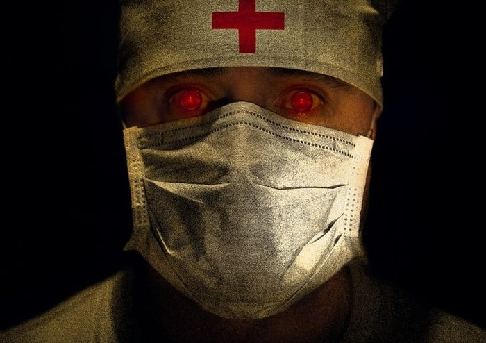
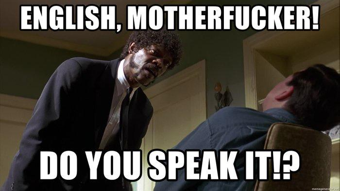
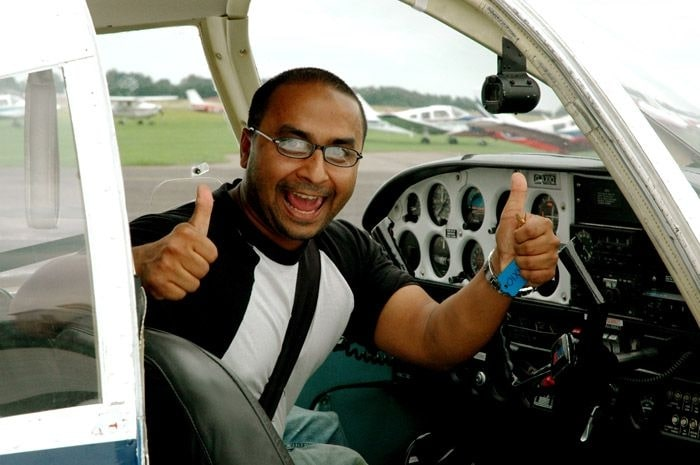
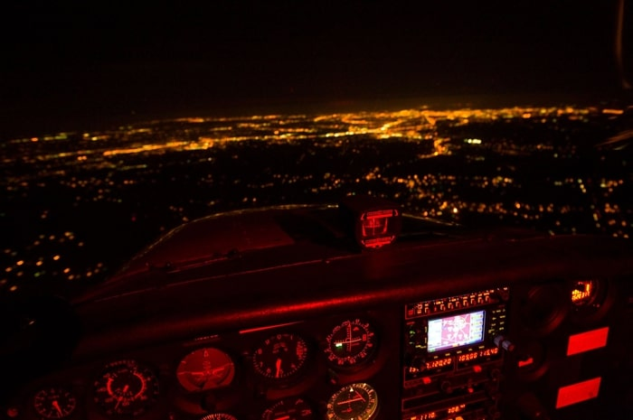
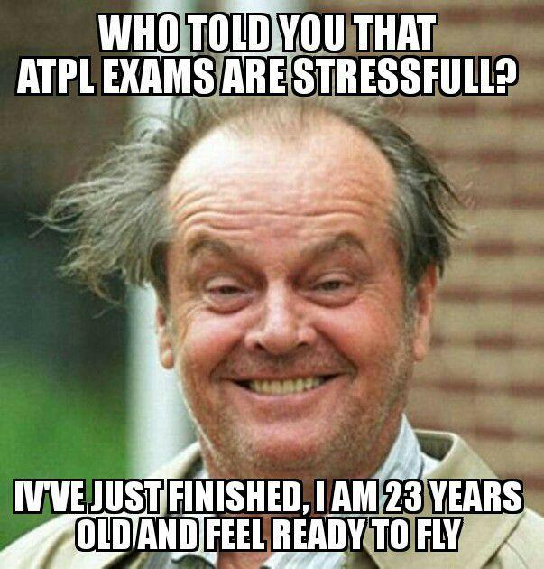
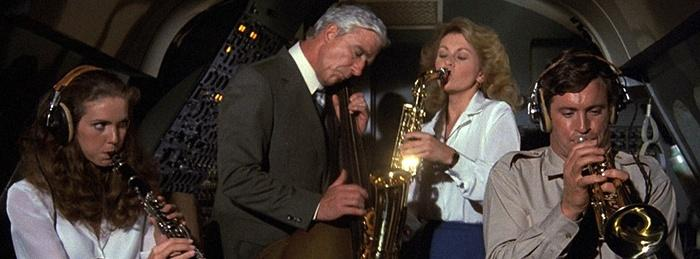
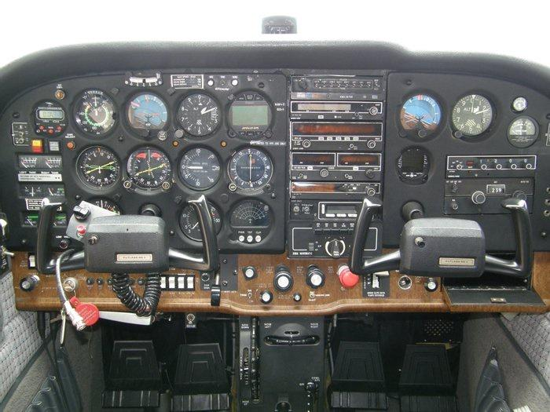
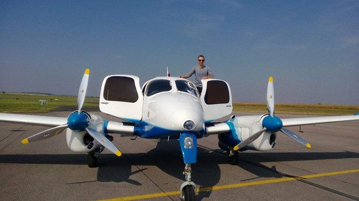
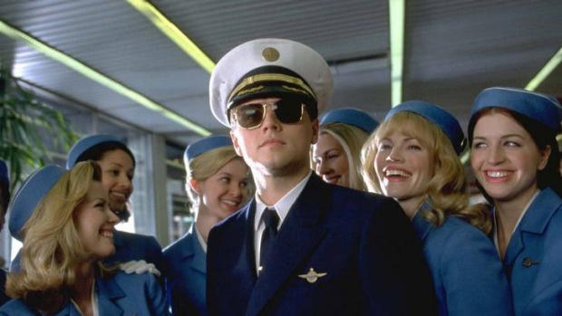
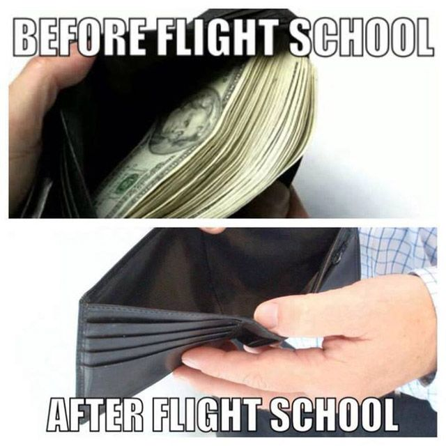

---
authors:
  - vsimakhin
categories:
  - Fly For Fun
  - All
tags:
  - Fly For Fun
  - Как стать пилотом
  - EASA
  - ATPL
  - CPL
  - PPL
  - IR
  - MEP
---

# Как стать пилотом

Как выучиться на пилота, что для этого нужно, сколько стоит и т.д. Я попробую описать весь процесс получения лицензии EASA в Европе и, в частности, в Чехии. Ни сколько не претендую на 100% достоверность (в каждой стране EASA есть свои особенности), просто опишу шаги, которые прошел сам.

### Немного теории

**PPL** - лицензия частного пилота. Позволяет летать практически на любом самолете (на который есть допуск), как говорится, for fun. Можно летать с друзьями, можно летать практически куда угодно, но нельзя зарабатывать от слова совсем.

**CPL** - коммерческая лицензия пилота. С этой лицензией уже можно работать в авиакомпания и зарабатывать деньги. На больших самолетах можно летать только вторым пилотом, на "однопилотных" по типу Cessna Caravan - даже капитаном.

**ATPL** - лицензия линейного пилота. Все то же самое, что и CPL, но уже можно летать капитаном на любом большом самолете, аля Боинг или Эйрбас.

**IR** - допуск на полеты по приборам в сложных метеоусловиях.

**ME** - допуск на многодвигательные самолеты.

**Type Rating** - сертификация\допуск пилота на конкретный тип самолета, который требует дополнительного обучения (наземная теоретическая подготовка, симулятор, аэродромная подготовка)

**ICAO English** - сертификат о знании английского языка.

**CAA** - министерство гражданской авиации, место, где выдают лицензии и сдаются все экзамены.

**Time building** - налет, необходимый для следующего курса или экзамена.

Ну, поехали…

### Медкомиссия

Первое, что нужно сделать - это пройти медкомиссию. В Европе существует два класса: первый и второй. По первому классу проходят пилоты коммерческой авиации, по второму - частные пилоты. Вообще, для начала достаточно и второго варианта, т.к. обучение начинается с частной лицензии пилота, но чтобы быть уверенным, что вы не зря потратите деньги и сможете дальше учиться, то лучше, конечно, пройти сразу на первый класс. Все обследование займет 1-2 дня в зависимости от страны: анализы, хирург, ЛОР, аудиометрия, окулист, психотесты, психолог, терапевт, невролог и ЭЭГ. Узнать где пройти медкомиссию можно на сайте CAA соответствующей страны. В Европе, например, первичное обследование проходится в специальных медцентрах, а потом продлевать медикал можно уже у частных врачей, одобренных в CAA.

Требования к здоровью в Европе намного проще, чем в той же РФ. К примеру, на первый класс можно пройти со зрением до -6, если оно корректируется очками. Полный список что можно, а что нельзя можно найти тут [Medical Requirements](https://www.easa.europa.eu/sites/default/files/dfu/Easy_Access_Rules_for_Medical_Requirements-Jun20.pdf).

Особое внимание стоит обратить на психотесты. Помимо стандартных вопросов "Любите ли вы смотреть на огонь" или "Иногда в порыве злости я не слежу за собой - да, нет", включают еще в себя различные задачки на логику, внимательность и хрен знает что, когда нужно сидеть за компом и жать на кучу кнопок, причем ногами тоже.

Медикал первого класса выдается на 1 год, медикал второго класса выдается на 5 лет.

### Английский и радиолицензия

Даже если вы прожили всю жизнь в Лондоне и у вас безупречный английский, все равно нужно будет сдавать тест ICAO English. Всего уровней 6, но в Европе минимальные требования - 4 и выше. Ничего такого особенного и сложного в тесте нет, если уровень знания языка как минимум Intermediate (причем реальный, а не вымышленный, максимум которого “Ай хэв брозер энд систер” и “Ландан из зэ кэпитал оф Грэйт Британ”). Во время экзамена нужно будет немного рассказать о себе, потом дадут послушать что-нибудь из эфира, прочитать какую-нибудь статью на авиационную тематику, ну и проверят знание авиационной фразеологии.

Помимо английского в некоторых странах (Чехия, Австрия, Германия, Голландия) еще требуют иметь радио лицензию на право пользоваться рацией в самолете (General Radiotelephone Operator’s Certificate).

### Лицензия частного пилота PPL

Курс состоит из двух частей: теория и практика. Во время теории изучаются Human performance and limitations, Air law, General knowledge of the plane and principles of flying, Meteorology, Navigation (general and radio), Communication and Flight planning. Потом нужно будет сдать экзамен в CAA и получить сертификат.

Практический курс (его можно начинать отлетывать еще до сдачи экзамена) длится минимум 45 часов. Технически говоря, первые 10-15 часов вы будете учиться сажать самолет - для новых пилотов это самое трудное, особенно при не совсем слабом боковом ветре. Потом у вас будет первое соло, которое вы будете помнить всю оставшуюся жизнь. Остальные ~30 часов - еще летать, летать и летать, большую часть между различными аэродромами как с инструктором, так и соло.

В конце курса будет чек-райд с экзаменатором примерно на 1,5 часа: полет по маршруту с отработкой экстренного и вынужденного приземлений, вывод из сваливания и т.д. Если все прошло успешно - идете в CAA и получаете свою первую лицензию.

Стоит обратить внимание, что 45 часов — это минимум, дальше все будет зависить от ваших умений. Перелет программы в 5-15 часов и даже больше — это нормально. В хороших авиашколах вас никто не выпустит в первое соло, пока не будут уверены на 100%, что вы сможете посадить самолет, даже в случае отказа двигателя.

Цена курса сильно зависит от типа самолета (С150 все таки дешевле, чем С172) и авиашколы.

### Ночной рейтинг

Для полетов ночью нужно получить ночной рейтинг. Тут все просто — теория плюс 5 часов налета ночью, большая часть с инструктором. В соло нужно будет выполнить 5 взлетов и приземлений. Ни теоретический, ни практический экзамены сдавать не нужно, после отлета программы просто идете в САА и там вам вписывают рейтинг в лицензию.

### ATPL теория

Все еще хочется быть профессиональным пилотом? Ну ок, поехали дальше. Следующий шаг - ATPL теория. С этого момента придется учить очень и очень много. Длится курс около 36 недель самообучения плюс 2х2 недели консультаций, и включает в себя 14 тем:

- Air Law
- Airframe, Systems, Electrics, Power Plant
- Engines and Electrics Instrumentation
- Instrumentation
- Mass & Balance
- Performance
- Flight Planning and Monitoring
- Human Performance and Limitations
- Meteorology
- General Navigation
- Radio Navigation
- Operational Procedures
- Principles of Flight
- Communications
- Knowledge, Skills and Attitudes

Часть тем уже перед этим была на PPL, но учить все равно придется практически с нуля и в разы большем объеме. По каждой теме нужно будет сдавать экзамен в CAA. Общее количество вопросов по всем темам около 15 000. Очень рекомендую пользоваться специальными сайтами типа [aviationexam.com](https://www.aviationexam.com/), где можно найти все вопросы, варианты ответов, объяснения, карты, графики и т.д.

По каждой теме нужно ответить правильно минимум на 75% вопросов, после чего вы получаете еще один сертификат. Всего 6 попыток на все темы, и максимум 4 на каждую.

### Instrument Rating

После первой половины ATPL теории можно начинать получать свой инструментальный рейтинг. Но перед этим нужно будет еще налетать как минимум 50 часов в PIC (Pilot in Command) - т.е. одному, без инструктора. Цена будет сильно зависеть от типа самолета.

SEP/IR (Single Engine/Instrument Rating) курс разделен на две части - симулятор и реальные полеты. Во время сессий на симуляторе изучаются основы полетов по приборам, т.е. слова VOR, ILS, NDB, RNP, SID, STAR и т.д. больше не будут казаться такими страшными. Плюс вы узнаете и научитесь пользоваться всеми странными стрелками на приборной панеле самолета

Дальше полеты на самолете в реальных условиях. И это самая крутая и захватывающая часть во время всего первоначального обучения! Вы будете летать в облаках, над облаками, выполнять заходы как на большом самолете, летать по маршрутам, разговаривать с диспетчером как будто вы пилот боинга и т.д.

В конце курса будет чек-райд с экзаменатором. Сам рейтинг действителен в течение одного года, после чего нужно будет опять летать чек-райд.
SEP/IR получается самым дорогим в процессе обучения.

### ME+IR

Следующий шаг - апгрейд ваших умений полетов на одномоторном самолете до многодвигательных (ME — Multi Engine). Разницы между ними практически нет, кроме нескольких вещей - они больше, тяжелее, быстре, жрут больше топлива и, самая важная часть, нужно уметь летать с одним неисправным двигателем. Да, большую часть программы вы все равно будете летать с одним двигателем, и это не так просто, как кажется на первый взгляд.

Плюс к ME нужно будет отлетать программу ME/IR — допуск для полетов в сложных метеоусловиях на многодвигательных.

Опять же, в конце курса еще один чек-райд с экзаменатором, который будет имитировать вам отказ одного из двигателей на разных этапах полета (взлет, круиз, заход). 

### CPL - коммерческая лицензия

Последний шаг в нашем квесте ради чего все это и затевалось - получение коммерческой лицензии пилота. Обычно курс длится 25 часов, но при наличии IR у вас будет "скидка", и общая длительность программы будет всего 15 часов летного времени. Сам курс очень похож на то, что было во время PPL. И потом опять еще один чек-райд, но перед этим нужно будет убедиться, что у вас есть как минимум 100 часов PIC и 200 часов общего налета в вашем логбуке. Если чего-то не хватает - берете самолет в аренду и налетываете недостающие часы.

### И сколько?

Так в итоге, сколько это все стоит? Приведу пример разбивки по курсам в [летной школе](https://www.flyforfun.eu/), где я проходил практически все обучение в свое время. Стоимость я сразу перевел в евро.

|Курс|Налет|Часы в сумме|Стоимость|Тип самолета|
|----|-----------------|------------|---------|------------|
|PPL |45 |45 |9 000| C150/152/P2008|
|PPL Theory + course fee| | |1 200||
|Exam PPL|1 |46 |200 |C150/152/P2008|
|Night |5 |51 |1 000 |C150/152/P2008|
|Time building |44 |95 |8 100 |C150/152/P2008|
|Theory ATPL |||1 500||
|Retraining DA-40 |2 |97 |560 |DA40|
|IR/SEP |50 |147 |9 800 |FNTP II/ DA40|
|Exam IR/SEP |2 |149 |550 |DA40|
|Time building |16 |165 |3 000 |C150/152/P2008|
|MEP |6 |171 |3 100 |P2006T|
|Exam MEP |1 |172 |500 |P2006T|
|IR/MEP |5 |177 |1 500 |FNTP II/P2006T|
|Time building |39 |216 |7 000 |C150/152/P2008|
|Retraining C172 |2 |218 |650 |C172RG|
|CPL |10 |228 |2 050 |C150/P2008|
|Complex plane |5 |233 |1 500 |C172RG|
|Exam CPL |2 |235 |650 |C172RG|
|**Total**||**235**|**51 860**||

### И что в итоге?

Ну вот и все, в конце всего этого у вас будет коммерческая лицензия CPL, 200+ часов в логбуке и минус приличная такая сумма на счете. С этим минимальным джентельменским набором уже можно начать искать работу в авиации.