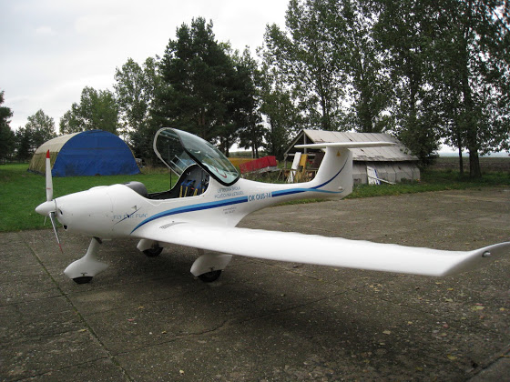
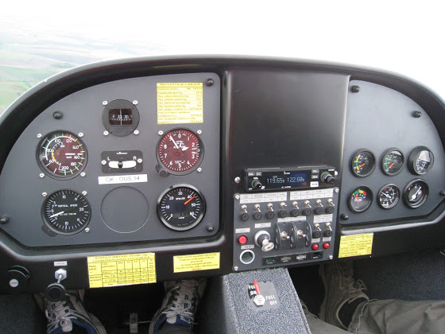
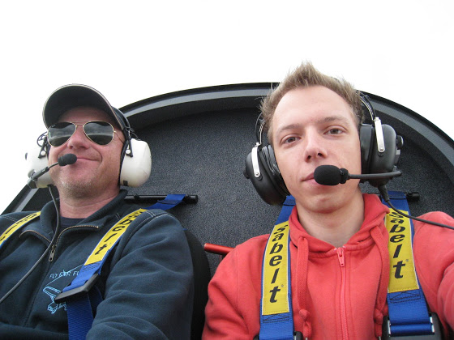
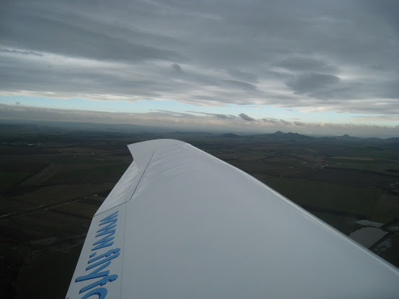
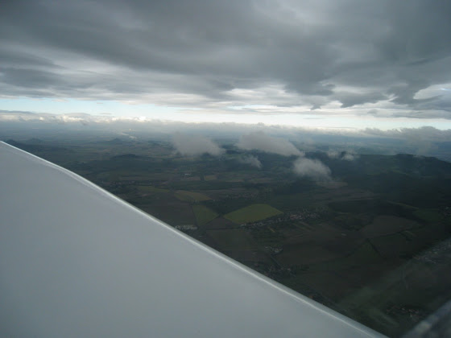

# Летадло

Сегодня с утра я поехал на аэродром возле Сазены (в 30 км от Праги), чтобы стать на шаг ближе к одному из пунктов моего виш-листа. Там меня уже ждало вот такое ультралегкое летадло.

<!-- more -->
Ультралегкие самолеты отличаются от других тем, что имеют максимальную взлетную массу до 450 кг, максимум два места (пилот+пассажир) и какое-то ограничение по скорости. А еще обучение на пилота таких вот штук стоит намного дешевле, чем на обычного пилота (~ в 4 раза). Хотя лицензия ULL(A) и имеет кучу ограничений, но летать то все равно можно!

Летал я, конечно же, с инструктором. Я сидел слева, он - справа. Пока прогревали двигатель перед взлетной полосой, инструктор рассказал зачем нужны вон те разные приборы со стрелками и всякие тумблеры, где штурвал и педали.

А потом выезд на взлетную полосу, разгон и взлет! Это было круто! Раньше я мог наблюдать, как самолет отрывается от земли только через окно пассажира в каком-нибудь боинге, и то если повезет с местом, а сегодня я взлетал в кабине самолета (и даже чуть-чуть держался за штурвал при взлете).

После того, как мы набрали высоту около 300 метров, я взялся за штурвал и повел самолет куда-то вперед. Неважно было куда лететь, главное - лететь. Оказывается, управлять самолетом совсем не трудно, практически как в играх с джойстиком. Тянешь на себя - самолет летит вверх, от себя - вниз. Влево, вправо - самолет поворачивает. Сначала я так впился в штурвал, что у меня рука очень быстро устала его держать. А потом минут через 15 я уже расслабился и просто летел, смотря по сторонам.

Тут последние несколько дней шел небольшой дождь, поэтому было очень много облаков. Но это только лучше. Можно летать над облаками, под облаками, через облака! Например, вот через такие маленькие и даже чуть побольше можно пролететь насквозь.

А если присмотреться, то тааам в далеке практически сплошная полотна из этих облаков, примерно на высоте около 2 км. Там мы летали уже между ними, как будто на трассе играли в "шашечки" (тут конечно самолет вел инструктор, я пока так летать не умею).

Летали мы чуть меньше полутора часов, но когда я вылез из кабины, ощущения были круче, чем после прыжка с парашютом. Можно сказать я был в небольшом шоке! Да и стоит это дешевле, всего 1700 крон в час (~ 2500 р). 

В общем, восхитительно, превосходно и просто очень круто! Всем советую!