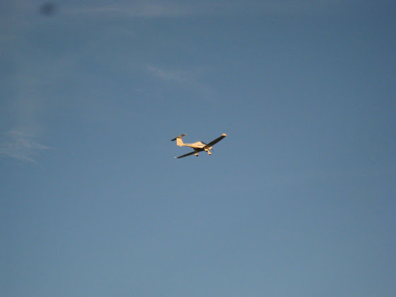

# Курсы пилота

Я тут пару недель назад начал ходить на курсы пилота ультралегких самолетов.

На фотографии пока еще не я управляю самолетом. Первые вылеты начнутся примерно через 1-2 недели, а пока у меня теория. Уже прослушал несколько лекций

<!-- more -->

* основные правила полетов (а вы знаете, что делать, если вы влетели в милитари-зону и вас перехватил истребитель?)
* основы аэродинамики (теперь я знаю, почему самолеты летают… и почему падают
* навигация (как хорошо, что человечество придумало GPS)
* радиообмен (оскар кило браво браво зулу)
* устройство и назначение приборов
* метеорология (ночью пройдет дождь, температура воздуха составит...)

Осталось это еще выучить

Весь курс состоит из 45 часов теории и 20 часов практики. После этого еще нужно сдать экзамен по радиообмену и все – можно летать на отдых, например, в Германию или Италию. Останется только купить самолет. Тот, на котором я буду учиться летать, стоит новый около 1,5 млн крон – примерно как дорогой автомобиль. А вообще можно найти и подешевле.

С другой стороны, если у меня когда-нибудь будет 1,5 млн крон, я их лучше потрачу на получение следующих лицензий PPL, CPL, ATPL – и тогда можно будет уже летать на боингах и аэрбасах. В Праге в университете ČVUT есть даже специальный факультет, который обучает на пилотов. Только есть одно но...  практику все равно придется оплачивать самому (~1 млн крон).