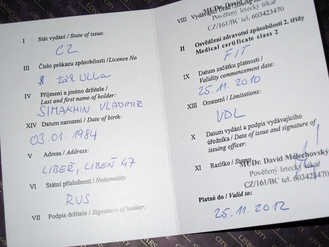

# Медобследование

Для того, чтобы приступить к практическим занятиям на моих курсах пилотов, мне нужно было пройти медицинское обследование.

Я то его прошел, и даже получил вот такой документ, как на картинке сверху, но как это было

<!-- more -->

Сначала меня положили на кушетку. На руки, ноги и грудь побрызгали спреем, чтобы был лучше контакт с электродом. Медсестра нажала на кнопки, и аппарат, который пишет кардиограмму, запищал и начал что-то рисовать. Потом она как-то удивленно посмотрела на график, еще раз меня побрызгала, переткнула электроды и запустила аппарат еще раз. Подошел доктор, тоже посмотрел на кардиограмму, медсестра стала показывать на график и говорить, что на нем что-то не хватает. Я уж начал думать, что карьера пилота для меня закончилась. На что доктор ответил, что если бы там что-то было, то у меня уже был бы инфаркт.

Дальше доктор повертел моей головой в стороны, поводил ручкой перед глазами. А потом он задвинул шторкой кушетку, ушел за нее и начал шептаться. Я думал, чего он там с медсестрами шепчется. В это время шторка отодвинулась и доктор удивленно спросил, почему я молчу. Тут я понял, что это была проверка слуха. Я ему объяснил, и мы решили попробовать еще раз. Он опять спрятался за шторкой и шепотом спросил "ваше поволаании" (ваша профессия). Я то это все услышал, но забыл, как переводится "поволаании". Пока я вспоминал значение слова, из-за шторки опять появилась удивленная голова доктора и спросила, почему я на этот раз молчу. После очередных объяснений, он решил, что у меня все в порядке со слухом.

Проверка зрения. Как всегда, на стене бумажка с большими, маленькими и ооочень маленькими буквами, только тут была латиница. Сначала правый глаз, потом левый. А потом доктор сказал одеть глаза. Это он решил перейти на русский и перепутал название очков.

Дальше еще несколько скучных тестов и мы пошли к его столу заполнять бумажки. Мне нужно было вписать имя и фамилию, я вписал. На что он опять вздохнул с улыбкой, что-то набрал у себя в компьютере, и на русском с акцентом сказал "разборчиво". Я посмотрел на то, что я написал, прочитал (а если я смог прочитать, что я сам написал, значит это написано разборчиво) и посмотрел на него. Оказалось, нужно было написать п е ч а т н ы м и буквами.

На листке еще нужно было отметить, какие хронические заболевания у меня имеются или перенес раньше. Все было понятно даже без словаря, нужно было просто поставить крестик, но доктор решил перестраховаться от образования кучи макулатуры, и переводил мне каждое слово. Наверно он пользовался гугл-транслейтом (а он очень хреново переводит с чешского на русский), потому что я таких болезней даже не слышал. А потом мне нужно было написать, что я не принимаю постоянно никаких лекарств. Ну кто ж знал, что опять "разборчиво".

А в конце он выписал мне свидетельство и пожелал удачных полетов.