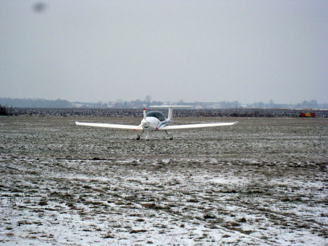
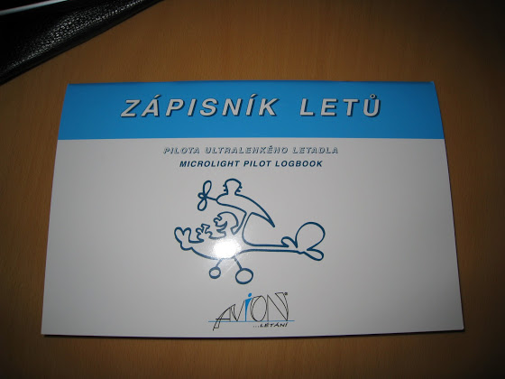
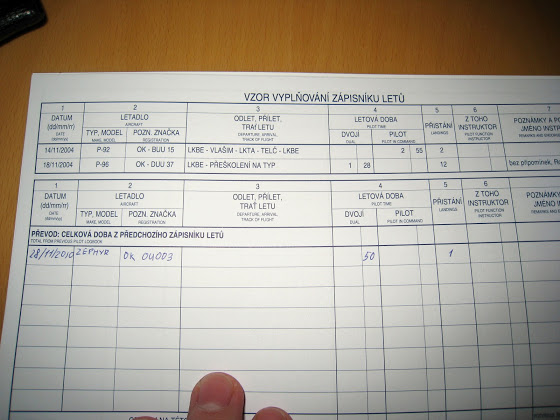

# Я опять летал

Нет, я не обкурился, у меня сегодня было первое практическое занятие на курсах. Вот на таком вот чуде я был над облаками на высоте 1000 метров.

<!-- more -->

Целью сегодняшнего занятия было знакомство с самолетом. Что есть, как заводится, как управляется, как взлетает и летает. В общем, крутота!

Еще у меня появилась вот такая книжка - так называемый лог-бук.

Обычный лог-бук обычных пилотов - это толстенная такая книга. У меня, как у будущего пилота легкомоторных самолетов, соответственно "легкомоторная" книжка. И сегодня я туда вписал мой первый полет - 50 минут, 1 посадка, регистрационный номер OK-OU003.

В общем, обалдеть!!!