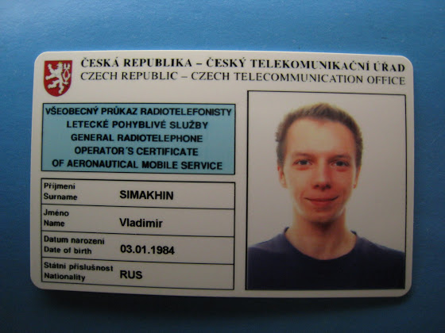

# Шаг 3. Удостоверение оператора

Для того, чтобы во время полета я мог общаться по рации, у меня должно быть удостоверение оператора радиотелефонной авиационной службы. А чтобы его получить, нужно сдать экзамен на знание и умение применять эту самую радиотелфн.. тьфу, в общем, нужно уметь общаться по рации, знать принятые сокращения, последовательность сообщений и прочее.

<!-- more -->

В Чехии этот экзамен сдают в Чешском телекоммуникационном управлении (Český telekomunikační úřad, а само удостоверение по-чешски называется všeobecný průkaz radiotelefonisty letecké pohyblivé služby), и стоит это удовольствие 400 крон. Каждые 5 лет удостоверение нужно продлевать за 200 крон.

Ну так вот, в ноябре у меня закончилась теория по летным курсам, и на следующей неделе я быстренько сбегал и подал заявку на сдачу экзамена. И, буквально, через неделю мне по электронке прислали приглашение на 16 декабря.

Сам экзамен состоит из 3 частей: письменный тест, коммуникация в английском языке, знание фразеологии и терминов.

Началось все в 9 часов утра. Нас посадили в большую аудиторию и в течение 15 минут рассказывали подробно о том, что нас ждет и кто будет принимать экзамен. Потом раздали листы с тестами и экзамен начался.

Письменный тест состоял из трех блоков и 80 вопросов (20 + 40 + 20). В каждом блоке можно было допустить не более 10% ошибок, т.е. ответить неправильно максимально на 2 + 4 + 2 вопроса. Вопросы и правильные ответы можно скачать прямо с самого сайта управления (естественно на чешском). Самый обычный тест, чем-то похож на тесты при сдаче на водительские права: один вопрос - 3 варианта ответа. На проставление крестиков напротив правильных ответов отводится 2 часа, но уже через полчаса все сдали листы и вышли из аудитории.

Дальше, если письменный тест успешно сдан, экзаменатор вызывает к себе для дальнейшей экзекуции. Меня вызвали вторым. В первой части я сделал всего одну ошибку, хотя какую - так и не сказали.

Сначала нужно прочитать текст на английском. Смысл этого теста заключается в проверки на знание английских букв, слов и правильность произношения. Потом нужно было этот текст перевести на чешский. Вот тут у меня был взрыв мозга - переводить с одного иностранного на другой иностранный - это то еще занятие. Хорошо, мне попался экзаменатор, который еще учил русский, поэтому если я не знал чешский перевод слова, то просто говорил на русском.

Дальше нужно было целое предложение "произнести по буквам", то есть A - это Alfa, B - Bravo, C - Charlie (мои любимые W - Whiskey и Z - Zulu) и т.д. Тоже самое было и про числа. Тут все просто, но есть один подвох и заключается он в том, что то же самое произношение могут спросить и на чешском, а оно немного отличается (A - Adam, B - Božena, C - Cyril и т.д.)

Следующим заданием было знание английских аналогов чешских фразеологизмов. Например, ANO - AFFIRM, ČEKEJTE - STAND BY и т.д. Тут тоже все просто, если, конечно, выучить.

Потом мне дали послушать запись разговора. Я сразу начал пытаться быстро все параметры записать на бумажку, но через пару фраз я уже сбился. Оказалось, нужно было выписать только номер взлетной полосы, QNH, направление и скорость ветра. С третьего раза мне это удалось.

Ну и еще нужно было привести пример того, что я собираюсь говорить, если у меня вдруг разгерметизируется салон. Ни минуты не сомневаясь, я ответил MAYDAY MAYDAY MAYDAY бла бла бла HIJACK. Тут экзаменатор напрягся и спросил, почему HIJACK, лучше бы сказать DECOMPRESSION. Нужно сделать небольшое отступление, до этого момента, я думал, что HIJACK - это когда самолет налетает на стаю птиц, а на самом деле это означает "я подвергся нападению... меня угнали". Я подумал, что разгерметизация салона может быть в результате образовавшейся дырки от какой-нибудь сумасшедшей птички. Вот это я и стал объяснять экзаментору. А теперь представьте себе экзаменатора, которому на вопрос о разгерметизации начали объяснять об угоне самолета птицами. Наверно, он все списал на мой чешский, потому что тест я все-таки сдал.