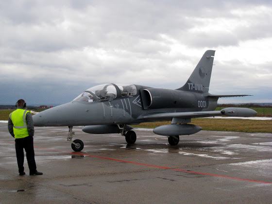
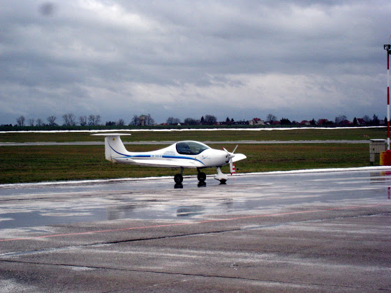

# +2h 42m 13x

Наконец-то выдалась более/менее нормальная погода и я смог полетать - если сначала был туман, то в последнюю неделю все таяло и взлетка была залита водой. Сегодня в летной книжке появилась еще одна строчка +2 часа 42 минуты и 13 посадок.

<!-- more -->

Нет, на фото не мой самолет. Этот ([Aero L-39ZA Albatros](https://en.wikipedia.org/wiki/Aero_L-39_Albatros)) мы встретили в Водоходах при посадке. Кстати, чтобы управлять таким самолетом, нужна самая обычная лицензия пилота PPL + квалификация на данный тип. Да, можно вот так взять, сесть и полететь. Стоишь рядом с таким самолетом с одновременными чувствами восхищения, зависти и офигевания.

Пока истребитель заправляли, немного разговорились с его пилотом:

- What is your plane?
- Zephyr ultra-light
- Wow
- Want to change? :)
- Mmm…. No! :)

Ну а вот мой Зефирка ([ATEC 122 Zephyr](https://en.wikipedia.org/wiki/ATEC_122_Zephyr_2000)).

