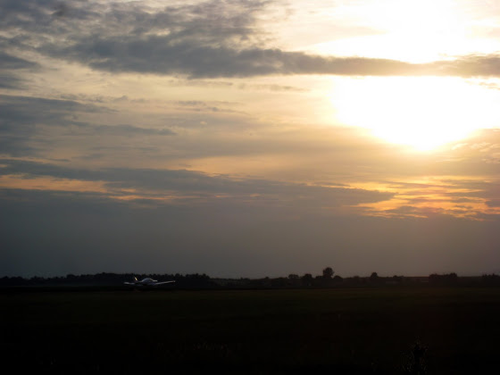

# +1h 05m 11x

Ну наконец-то, а то последний раз летал почти два месяца назад. Так как был долгий перерыв, то никакого соло сегодня не было - только обычные полеты по кругу и тренировка взлета/посадки. Как оказалось, летать не разучился и даже совсем не забыл как это делается. Конечно, первые взлет/посадка сегодня были похожи хрен знает на что, но все остальное было практически идеальным.

А еще очень круто летать под вечер – закат солнца там наверху великолепен

