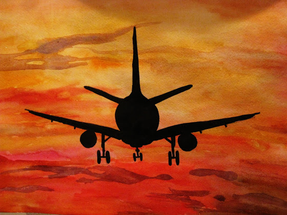

# +1h 30m 15x

И из них 3 посадки и 18 минут – соло! Первый соло полет! Самое удивительное, что страшно не было, наверное из-за того, что я уже выполнил перед этим 216 взлетов и посадок. Управление было немного необычно (~100 кг инструктора дают о себе знать на легкомоторном самолете) - скорость набирается быстрее, высота тоже набирается намного быстрее (немного штурвала на себя и ты уже на высоте 100 метров) и посадка как-то плавнее. В общем, ощущения от такого полета – непередаваемые, похоже на самый первый полет, только намного круче.

