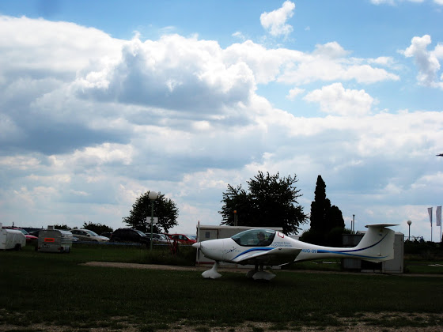
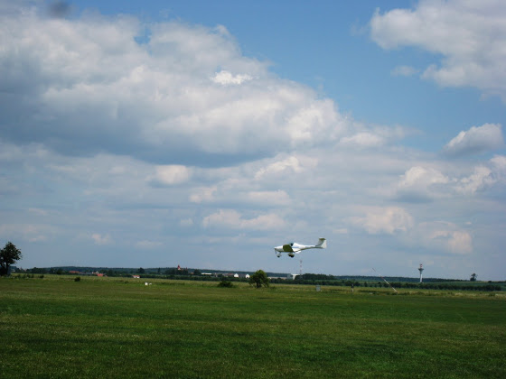
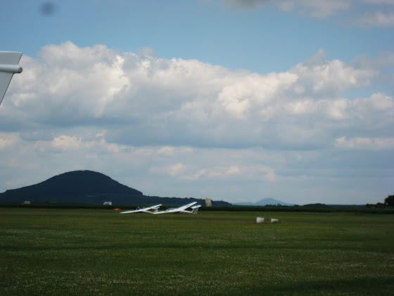
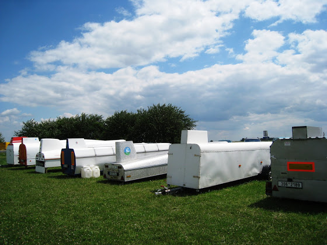
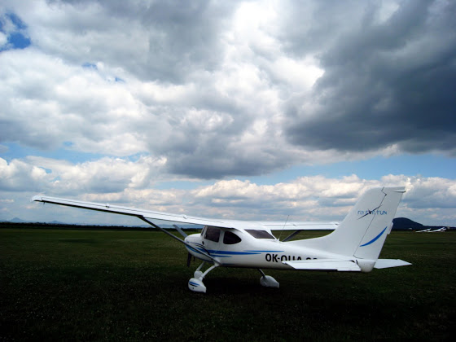
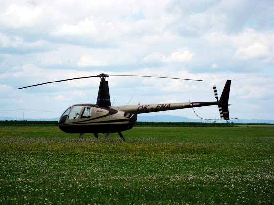

# +50m 7x

Вчера опять полетал, только уже с инструктором. На земле была такая болтанка, что мы просто отрабатывали взлет/посадку при сильном ветре. Пока я летал, Улка бегала с фотоаппаратом, поэтому сегодня будет побольше фотографий.

Только завелся, включаю радиосвязь и проверяю приборы.

<!-- more -->

В этот день в воздухе было очень много самолетов и весь поток регулировался диспетчером, поэтому после того как я сказал по рации, что завелся и собираюсь идти к взлетке, меня тут же поприветствовали с башни - раньше с диспетчером я еще ни разу не переговаривался. Вообще, необычно и немного непривычно. До этого летал себе и никого не трогал, а тут приходится кого-то слушать, повторять команды и выполнять их. По началу просто с непривычки не обращал внимание на запросы от башни, но инструктор периодически "пинал" меня.

Вот это я захожу на посадку

Тут не видно, но крыльями я махал при таком ветре часто.

По поводу остальных "бортов", которые в этот день были в воздухе - в основном это были вот такие глайдеры (или планеры по нашему).

Запускаются они с помощью других самолетов: на земле цепляются, в воздухе - отцепляются. Минимальная скорость полета у них меньше, чем даже у ультралайтов, а в этот день они явно никуда не торопились, поэтому иногда приходилось делать больший поворот, чтобы не обогнать его при посадке. Пару раз даже "уворачивался" от таких в воздухе. Глайдеры все, в основном, частные, хранятся они в поле и перевозятся вот в таких штуках.

Снял крылья, сложил все вместе и закрыл коробкой.

А это новый ультралайт Sirius на нашем аэродроме, школа прикупила его где-то месяц назад.

До этого в ангаре были утралайты только с нижним расположением крыльев. Вообще, я так понял, это как священные войны на тему "Windows или Linux", "Хэтчбэк или седан" и т.д. Тут также, кому-то нравится летать на на самолетах с нижним расположением, кому-то - с верхним. Пока у меня не закончилось обучение я не могу менять типа самолета, поэтому на сириусе полетаю чуть позже.

И как бы незаметно среди самолетов припарковался вертолет.

