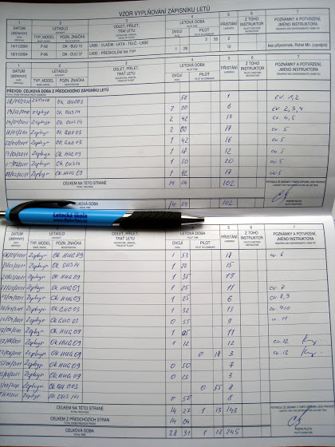

# +50m 8x/11m 1x

Моя "девятка" все еще в ремонте, летал я опять на другой зефирке. Самолеты хоть и одной модели, но для меня управление немного отличается. Самое интересное началось после того, как я отлетал контрольный вылет и приготовился к соло. Сначала резко усилился ветер - было видно, что с севера идут большие тучи.

Где-то на середине круга я подумал, что нужно закрыть окошки в панорамном стекле, т.к. что-то уж больно сильно дует. Закрыл - все равно дует. Закрыл вентиляционные решетки - дует, причем как-то сильно поддувает с правой стороны. Поворачиваю голову и вижу 10 сантиметровую щель между корпусом и панорамным стеклом О_о. Попробовал прижать стекло рукой - когда-нибудь пытались полностью высунуть руку из машины на скорости 120 км/ч? Так вот это фигня. Стекло удалось прижать немного, но щель в 5 см еще оставалась. А еще нужно было следить за скоростью, высотой, менять обороты двигателя (хорошо я уже был на третьем повороте, поэтому просто снизил обороты до минимума и дальше летел практически планируя) и менять положение закрылок, и все это практически одной рукой.

В общем, в этот раз посадка у меня была немного в экстремальных условиях - приоткрытое стекло и сильный ветер. Инструктор потом сказал, что у него два раза это стекло слетало с защелки, просто перед взлетом нужно получше проверять крепление, а само его можно и не держать - в теории, открыться не должно.

Ну а еще у меня закончилась вторая страница в летной книжке и началась третья. Всего у меня пока налетано 28 часов 31 минута с инструктором и 1 час 24 минуты соло, и за это время я выполнил 246 взлетов и посадок.

