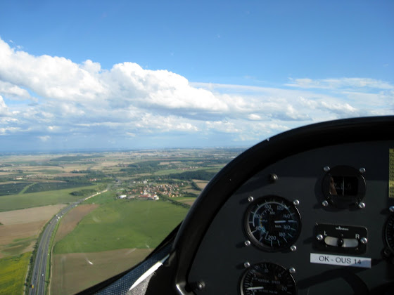
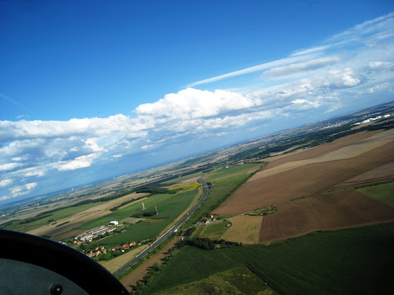
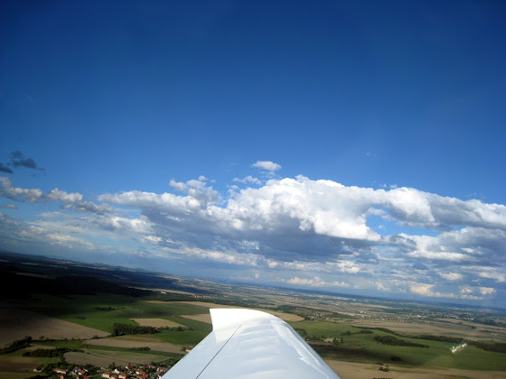
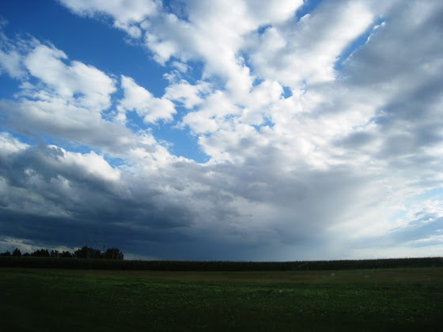

# +1h 04m 7x

Летал на прошлых выходных, но время написать нашел только сейчас. Почти час полетов, из них 34 минуты в соло. Да, надоело в заголовке разделять соло и полеты с инструктором, т.ч. теперь будет опять все вместе.

<!-- more -->

Упражнение должно было заключаться в "исправлении" ошибок при полете. У меня уже было такое, но с инструктором – он постоянно дергал штурвал на себя при посадке, либо вырубал до минимума обороты двигателя. В этот раз я летал соло и сам себе таких подлянок не устраивал, да и не нужно было - ветер из-за холодного фронта дул такой, что трясло очень даже прилично. Один раз болтнуло так, что если бы был непристегнут, то точно бы выбил стекло головой. В общем, была крутая практика посадки при очень сильном ветре.

Отлетал я немного, т.к. под конец уже было совсем нереально сложно садиться (даже глайдеры все приземлились). Но зато в такую погоду наверху очень круто

Здесь я уже приземлился и еду к ангару, т.к. вот эти тучи становились все ближе и ближе

