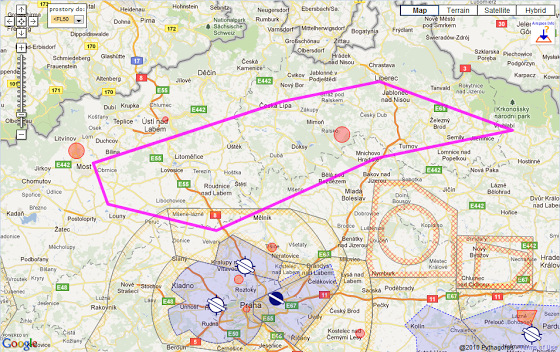

# +2h 15m 3x

На выходных отлетал 300 км с навигацией по карте (LKSZ – LKRA – LKMO – LKCE – LKLB – LKVR – LKMH – LKSZ). Жесть конечно! Нормально ориентироваться стал только на последних ~100 км. До этого с переменным успехом получалось сопоставить либо карту с местностью, либо местность с картой. Инструктору карта, кажется, вообще не нужна - он в любой момент мог без нее сказать над какой деревушкой мы сейчас летим, какое озеро слева от нас, и вон за той горой будет очередное шоссе, лес и еще один холмик.

Перед полетом весь маршрут с контрольными точками и временем я вычертил на карте специальным маркером, который стирается, если его потереть влажной салфеткой. В первые полчаса стресс-полета я умудрился смазать своими пальцами почти все контрольные точки и весь маршрут. Хорошо у меня был отдельный листок, на котором были записаны расстояние, ориентировочное время, курс и частота для всех аэродромов, которые я пролетал.

Впереди еще один полет по карте на 1 час (~150км) с инструктором и такой же, но уже соло.