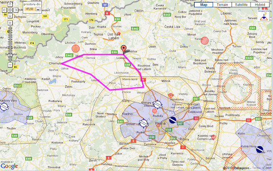

# +1h 9m 2x

На выходных отлетал часовой полет по карте с инструктором, после которого должен был лететь уже один. Но не получилось. Если с навигацией по карте у меня никаких проблем не было, то с определением направления округа и правильной посадочной полосы - косяк полный. Сначала спутал левый округ с правым, потом вместо посадочной 22 стал заходить на 32...! В общем, инструктор сказал, что нужен еще один дополнительный полет, иначе я всех перепугаю в воздухе. И еще он сказал, что следующий маршрут должен проходить через как много большее кол-во аэродромов, чтобы я уверенно себя чувствовал при пролете зоны.

Кстати, в этот раз я ориентировался по карте 1:500 000 (а не 1:200 000 как в прошлый), которую нужно обязательно иметь с собой на борту.