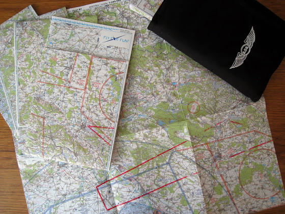

# +1h 50m 4x

И еще одна подготовка к соло по карте и опять неудачно. Если в прошлый раз я терялся над взлеткой, то в этот раз все было отлично - взлетки распознавал еще на подлете, округ тоже запрашивал/определял, да и все приземления отлично получились. Было только два косяка - пару раз срезал круг и слишком рано пошел на посадку, а второй раз - сбился с пути и полетел в закрытую зону (там сегодня истребители летали).

Вон тот круг в правом нижнем углу - это и есть та закрытая зона, куда я сегодня и полетел. Ярко красные линии - проложенный маршрут.

Да, еще я сегодня прикупил карту 1:200 000 (состоит из 5-и частей), чтобы легче было ориентироваться. На ней показаны все взлетки на всех аэродромах и направления округов, что, в принципе, очень удобно, так как не нужно смотреть еще и в базу данных аэродромов в процессе полета (тоже такая специальная книжка, но ее у меня нет).