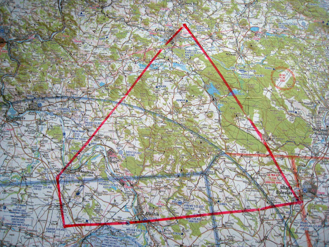

# Полеты по карте

Казалось бы, что сложного в полете по карте - вот карта, вот маршрут, вот все взлетки со всеми данными - лети и наслаждайся. Ага... в воскресенье была уже третья попытка - опять ступил над аэродромом, опять перепутал взлетки, опять улетел от маршрута. Это немного похоже на первые часы за рулем машины - в сложной ситуации начинаешь вытворять на дороге такую фигню, что другим страшно становится.

В общем, инструктор порекомендовал пока просто поупражняться в течение пары занятий, а уже потом идти на "зачет". Вчера как раз было такое упражнение - 4 аэродрома и 140 км маршрута. Спокойно и ни куда не торопясь, подлетел, покружился над аэродромом, встал в круг, приземлился, взлетел, улетел дальше. Потерялся, правда, немного (был туман и солнце в глаза), но потом быстро нашелся. Еще 1-2 таких занятия и можно уже будет лететь соло.

