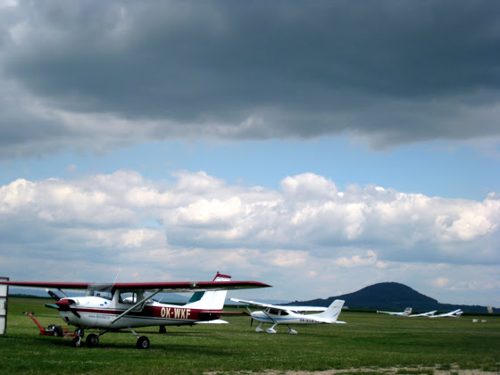

# PPL, начало

Пока я жду своих экзаменов на ULL лицензию, сделал еще один шаг к большой авиации - начал летать на PPL (Private Pilot Licence – лицензия обычного пилота). Пару недель назад дослушал недостающую лекцию по теории, а сегодня уже отлетал свой первый час и сделал 3 посадки на цессне 150 (вон тот белый самолет с красно-коричневыми полосками).

Первое, что "бросается в глаза": ультралегкий "зефирка" по сравнению с цессной - просто шустрик. Если при наклоне штурвала зефирка сразу же уходил в поворот, то цессна делает примерно так - "ммм... нууу давай повернем".

Еще очень необычно летать с верхним расположением крыла: смотришь в полете в бок - а крыла нет. А с непривычки я бьюсь головой, когда сажусь/выхожу из кабины.

И да, при третьем приземлении я самолет посадил уже полностью сам, немного жестковато конечно, но это я еще просто не привык к высоте кабины.