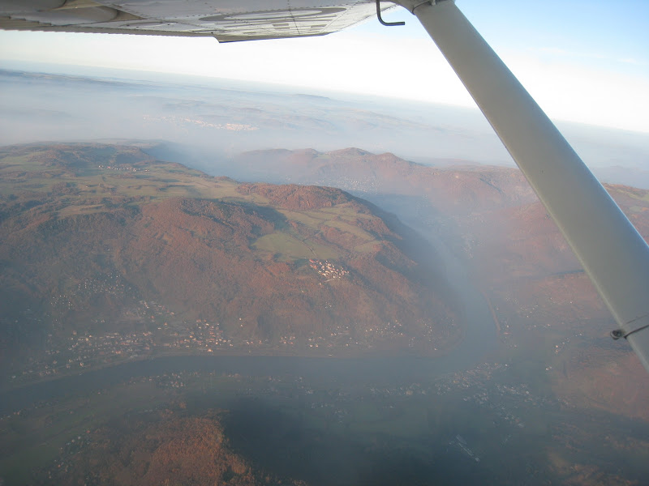

# FL65

У нас над взлеткой был такой густой туман, что с высоты круга ее уже практически не было видно. Поэтому мы вылетели за 3 000 футов, и я немного повторил повороты на 15/30 градусов, повышение и снижение высоты. А дальше... дальше я поставил новый рекорд высоты, на которой я был за штурвалом: 6 500 футов - FL65. До этого на зефирке я поднимался только до 3 000. Кстати, 6 500 это при стандартном давлении 1013 hpa, которое выставляется при переходе границы в 5 000 футов. По второму высотомеру, который был выставлен при взлете на 1035 hpa, высота была 7 000 футов.

Да, летал я сегодня над Чешским раем. Вот это примерно в 15 мин полета от него на высоте 4 500 футов

