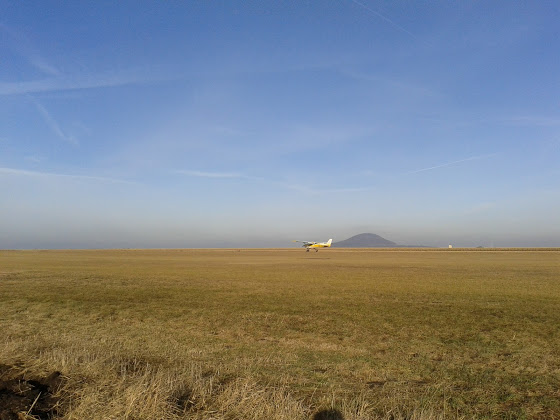

# Опять полеты

На прошлой неделе летал по кругу в сильный ветер, а на этой - исправление ошибок при приземлении - например, рано обороты сбавил, слишком сильно руль на себя потянул и т.д. Имитировал ошибки инструктор, мне же нужно было выправить и нормально посадить самолет.

Вот, кстати, программа обучения на PPL (цифры - кол-во приземлений/минимальное время чч.мм)

1. Ознакомительный полет - 1/0.15
1. "Знакомство" с управлением в полете - 1/0.30
1. Полеты по прямой, горизонтальные полеты, повышение/понижение высоты, повороты - 5/2.30
1. Полеты на малых и минимальной скоростях, выход из штопора - 4/2.00
1. Полеты по кругу, взлет, приземление - 30/3.00
1. Исправление ошибок при приземлении - 10/1.00
1. Вынужденные приземления с круга - 10/1.00
1. Проверка перед первым соло - 2/0.20
1. Первый соло полет - 2/0.10 (соло)
1. Полеты по кругу - 3/0.15 - 20/2.00 (соло)
1. Практика технического пилотажа - 2/1.00
1. Вынужденные приземления - 2/1.00
1. Экстренные приземления - 2/1.00
1. Полет по приборам - 1/0.30
1. Навигационные полеты - 10/7.00
1. Проверка перед соло навигационным полетом - 2/1.20
1. Навигационные полеты - 10/6.00 (соло)
1. Полет на 270 км - 3/2.00 (соло)
1. Полеты в управляемых (диспетчерами) зонах - 3/2.40

Всего 45 часов. Перевел местами коряво, но других слов подобрать не получилось. Вообще в плане 32 пункта, там почти перед каждым упражнением еще есть наземная подготовка.