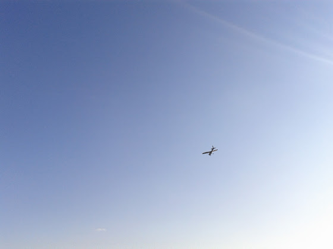

# Второе первое соло!

Второе – потому что уже было на ультралайте, а первое – потому что первое на "взрослом" самолете.

Ну а перед этим был целый час полетов вокруг взлетки для тренировки экстренной посадки. Взлет, полет по кругу и приземление - все как обычно, но в любой момент инструктор мог вырубить обороты на минимум - тут либо высматривать подходящее поле, либо пытаться, если есть такая возможность, приземлиться на посадочную полосу. В приципе, почти все то же самое, что и на ультралайте, но нужно учитывать, что цессна тяжелее и высоту теряет намного быстрее.