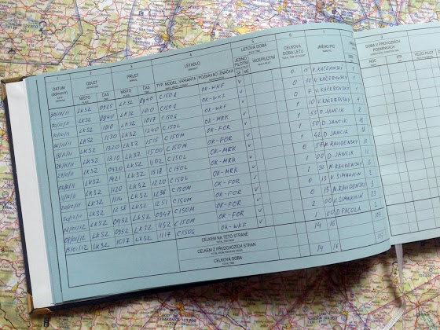

# 3 часа в солнечное воскресенье

Отличная погода и отличные 3 часа полета. Пилотаж ("острые" повороты, полеты на минимальной скорости, предотвращение штопора и т.д.), экстренные приземления (что делать, если вдруг пожар или двигателю каюк :) и вынужденные приземления (ваш пассажир отравился печенькой? тогда вам вооон на то поле). В общем, крутота!

А еще у меня закончилась первая страница лог-бука, уже пишу на второй. Общий налет – 16 часов 13 минут.

В следующий раз будет сначала полчаса полета по приборам, а потом начнутся полеты по карте.