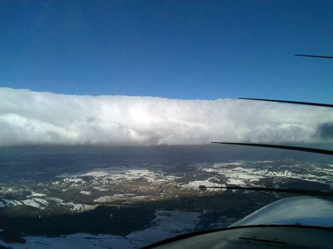

# Полеты, экзамены

Все никак времени не было написать про последние события... вот пишу.

Первое. В прошлое воскресенье отлетал два упражнения. Полет по приборам - одеваешь специальные пластиковые очки с небольшой прорезью внизу, которые позволяют видеть только приборную панель (можно, конечно, задрать голову повыше, но смысл упражнения теряется), и летишь, ориентируясь только по авиагоризонту, часам (именно! за 1 минуту при наклоне 15 градусов самолет поворачивает ровно на 180 градусов), вариометру и высотомеру. Упражнение отрабатывается только на тот случай, если вдруг случайно влетел в облако (среднее время жизни VFR пилота, который оказался в условиях IFR - 178 секунд O_o), т.к. для полноценного полета по приборам существует отдельная квалификация IR - Instrument Rating.

Полет по карте. Тут как и на ультралайте - ничего сложного, но пару раз я потерялся, нужно будет получше подготовиться в следующий раз. Зато погода была отличная.

Второе. В понедельник ездил сдавать теорию на PPL. Экзамен состоит из 9 частей (модулей) по 10-20 вопросов (примеры на чешском), по каждой части минимально 75% правильных ответов. В общем, одну из частей я завалил, нужно просто было быть внимательнее. Через месяц пересдавать, но уже только один модуль, а не весь тест целиком.