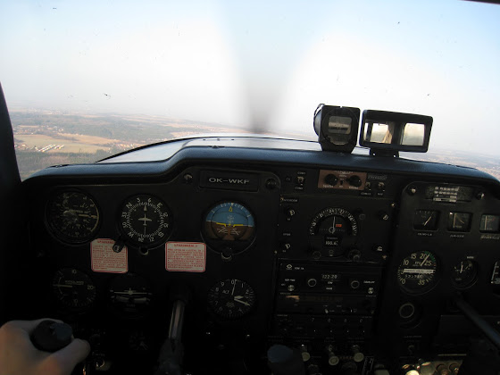
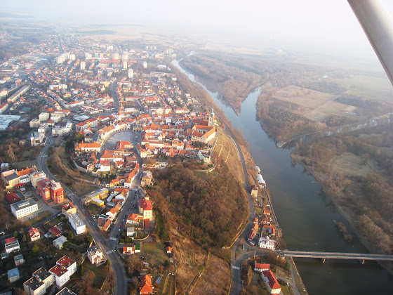
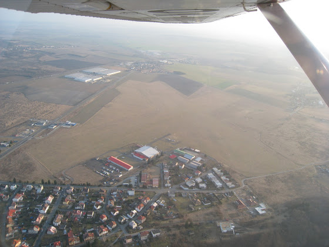

# 2 часа в небесах

Наверняка уже соскучились по моим уникальным постам про полеты? Так вот, все это время я налетывал часы с инструктором, проходил медосмотр и опять налетывал часы (у меня уже третья страница лог-бука пошла). А сегодня у меня был первый самостоятельный вылет - вокруг Праги. Над самой Прагой сложно летать, т.к. нужно запрашивать разрешение, лететь только по определенным точкам и т.д., а вот чуть подальше от центра - уже практически свободно.

Вот это был вид из кабины

<!-- more -->

В салоне 100500 приборов (спидометр, гироскопический компас, магнитный компас, искусственный горизон, вариометр, высотомер и еще дохрена всяких индикаторов), нужно их постоянно контролировать, смотреть на карту, на землю, потом опять на карту (конечно у меня есть с собой GPS, но так было бы не честно), я еще успеваю фотографировать - развиваю в себе многозадачность.

Пригород Праги, над Мнелником

А это один из промежуточных аэродромов Млада Болеслав с двумя взлетными полосами

Таких вылетов будет еще около 6 часов, потом пару часов с инструктором и опять самостоятельные вылеты еще на, примерно, 8 часов.