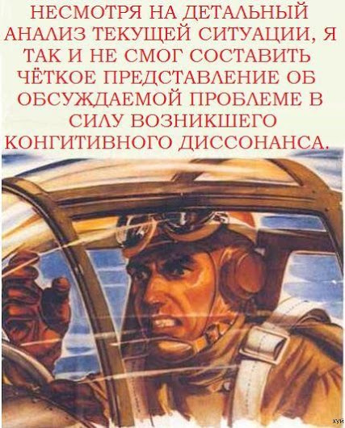

# три, четыре… закончили упражнение

В среду отлетал последнее обязательное упражнение - полет в управляемых зонах. Почти 2 часа летал по команде диспетчера. Если попытаться описать мое состояние в самом начале, когда он мне начал давать команды, то будет это выглядеть примерно так

В принцие, когда мы разбирали возможные ситуации на земле, все было понятно и просто. Clear for low pass runway 28, heading runway 28, climb 2500 feets, after turn right november echo romeo - ну что тут может быть непонятного? Но блин, там в воздухе, в первый раз, очень было сложно понять, что от тебя хотят (хорошо инструктор рядом подсказывал). Я потом попросил диспетчера говорить чуть помедленнее - иначе я просто не успевал запомнить, что он мне передавал. Смысл в том, что недостаточно просто слушать, нужно в ответ еще повторять то же самое, чтобы диспетчер убедился, что ты все правильно понял\принял.

Кстати, во время всей этой несуразицы я два раза заходил на посадку по приборам (ILS) - прям как настоящий авиалайнер заходит в условиях плохой видимости - оказывается, это очень просто.

В общем, после пары часов стресса мы сделали кружок вокруг Праги с залетом в две управляемые зоны и с обычным пролетом. Тут было намного проще - я уже запрашивал раньше разрешение - position ricany, altitude 1700 feets, heading to the north, squawk 7000, request ctr from ricany to brandys below 2000 feets - все, дальше еще пару сообщений и летишь себе до нужной точки. Если собьешься с пути, то диспетчер перенаправит - turn left, heading 280

Ну вот, теперь мне осталось просто долетать 6 часов, и можно идти сдавать практику. Нужно только дождаться хорошей погоды.