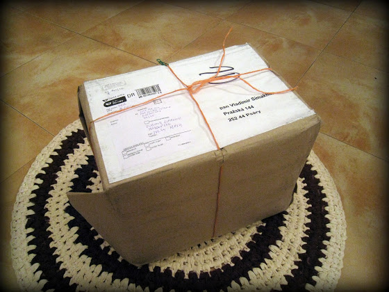
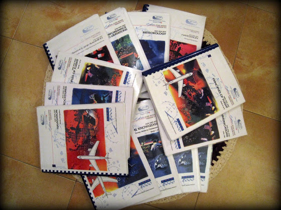

# Посылка

Вчера получил вот такую посылку

А внутри…
<!-- more -->

... 10 кг учебников (17 штук) по курсу подготовки профессиональных пилотов ATPL! Теперь мне каждую неделю нужно будет очень много читать/учить, проходить по два теста, а в конце июня будет первая сессия. Вся теория занимает 650 часов или 36 недель.

Полный курс ATPL получается дешевле примерно на $1500, чем если брать по отдельности курсы IR, CPL и т.д. Ну а так как в моей авиашколе своей теории ATPL пока еще нет, то я записался в другую - letsfly.cz. Весь курс, консультации, сессия и последующие экзамены на английском языке.