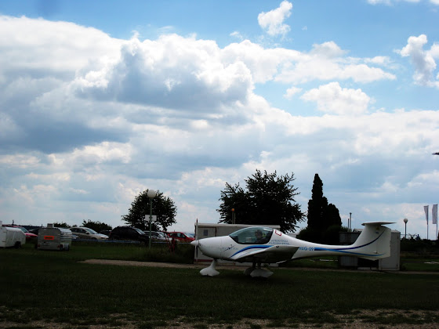

# Пилот

Мы строили, строили и, наконец, построили! В смысле вот... теперь я дважды пилот - ультралегкий и обычный.

Отличия ультралегких самолетов - максимум 2 человека, максимальный взлетный вес 450 кг с учетом пассажиров, багажа и топлива, а еще они залазят на дерево при виде таксы. Например, вот этот Zephyr, на котором я получал ULL

Обычный самолет, например, Cessna 150 - уже полностью железный и пустым весит 500 кг

В общем, сейчас я могу управлять любым одномоторным самолетом в личных целях (работать пилотом пока еще нельзя).