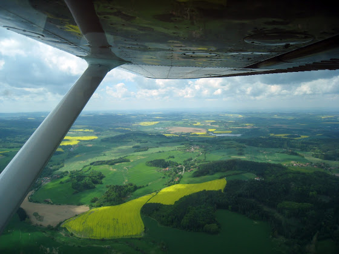
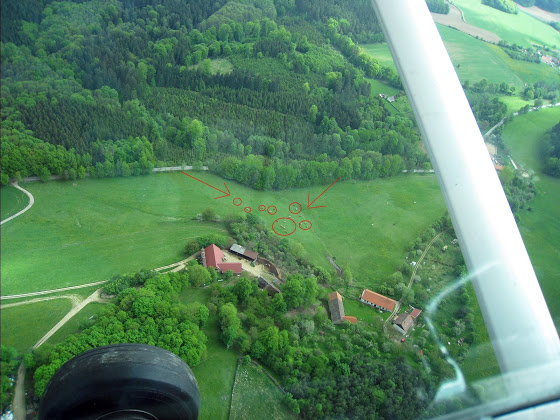
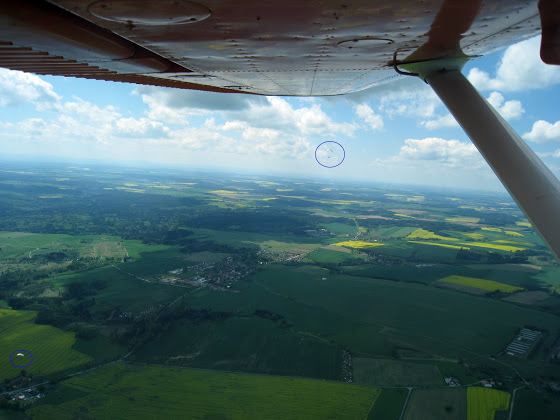

# Почти как в первый раз

Довольно необычное чувство, когда можешь сесть в самолет и полететь куда угодно, не получая при этом никаких допусков у инструктора. В общем, я сегодня первый раз вылетел не как студент, а как обычный пилот.

Стартовал с аэродрома в Бубовицах (Bubovice), который поближе к дому, и, соответственно, самолет в аренду брал уже в другой авиашколе [OKAir](https://www.okair.cz). Взлетка здесь короче, чем на Сазене на 500 метров, но и ее хватает, чтобы сделать touch-and-go.

<!-- more -->

По дороге встретились пасущиеся барашки

и летающие парапланеристы

Кстати, так как мне все равно куда летать, то я могу кого-нибудь и покатать - мне налет часов, а вам новые впечатления. Мне час полета с учетом приземлений обходится в 2 500 крон, готов за 1 000 крон взять с собой. Пару ограничений - не летаю над Прагой и крупными городами в зоне управляемых полетов (просто класс транспордера\передатчика в самолете не позволяет) и не делаю акробатику. Самолет - Cessna 150, 2 места - пилот + пассажир. Вот тут карта Чехии с зонами - [https://www.airquest.cz/map](https://www.airquest.cz/map). Синие зоны - управляемые диспетчерами, красные - закрытые\частично закрытые (некоторые можно подлетать, а некоторые надлетать), все остальное - свободное для полетов.