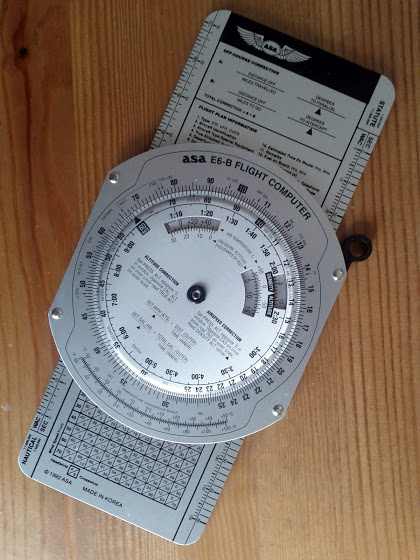
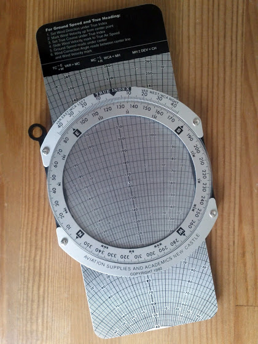
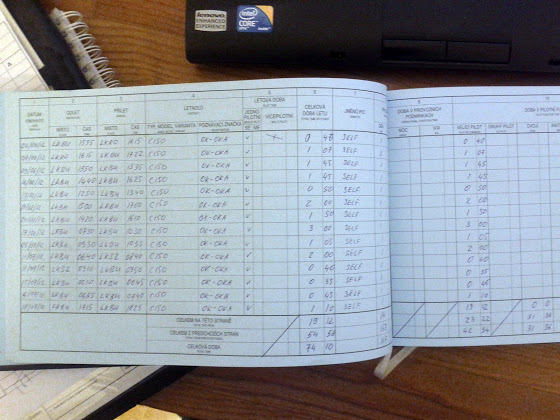

# ATPL теория

У меня тут пару дней назад начались оффлайн лекции по ATPL теории, уже "прослушал" общую навигацию и радионавигацию (после каждой лекции нужно сдать тесты не менее 75%). Инструктор - действующий пилот, летающая на ATR42/72. Круто и интересно! Во-первых, теория, задачки и прочее. Во-вторых, можно поспрашивать настоящего пилота о полетах, самолете, приборах, процедурах и т.д.

Для задачек по навигации прикупил специальный летный компьютер

с другой стороны

Позволяет рассчитывать скорости (IAS, GS, TAS и т.д.), время, расстояния, расход топлива, перевод из одной системы в другу (км, мили, литры и т.д.), боковой ветер, дрифт и еще кучу всего другого. Я бы сказал, очень удобная штука, логарифмическая линейка отдыхает.

Ну и еще у меня закончилась пятая страница лог-бука, общий налет 74 часа 10 минут, из них PIC (pilot in command) - 42 часа 34 минуты.

