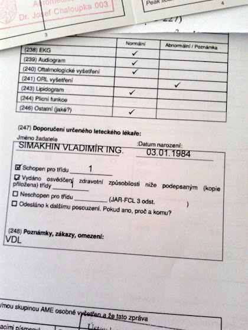
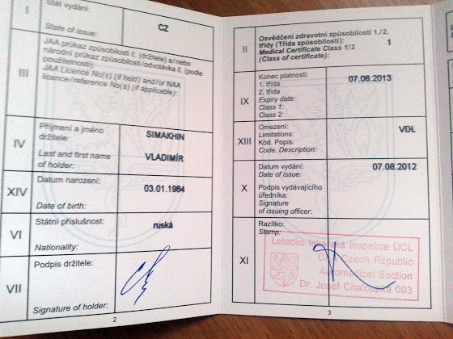

# Медкомиссия

Чтобы получить лицензию частного пилота (PPL), нужно пройти медкомисиию и получить, как минимум, 2й класс (class 2 medical examination). А для лицензии коммерческого пилота и пилота авиалиний нужно иметь 1й класс. Так вот, чтобы быть уверенным, что я не зря учу теорию и налетываю часы, решил пройти медкомиссию заранее еще до курсов на коммерческого пилота (CPL).

<!-- more -->

Медкомиссия на первый класс длится 2 дня. Для начала нужно зайти на сайт ULZ, позвонить по указанному телефону и записаться.

В первый день нужно прийти к 7 часам утра. Напротив приемной нужно взять бланк и заполнить его, потом будет небольшая процедура заполнения других бумажек + оплата (~11 000 крон), в конце которой на руках будет список врачей с номерами кабинетов, которых нужно посетить. Порядок посещения - рандомный на свое усмотрение, опишу, в каком я их проходил.

* Лаборатория для сдачи крови и мочи. С собой ничего нести не нужно, рядом с лабораторией в конце коридора есть туалет, в котором стоит шкаф со стаканчиками (называются шампусики :) После наполнения так называемого шампусика ты гордо идешь с ним через весь коридор. Кровь берут из вены, проводят 3 типа анализа, мочу проверяют прямо там же специальной бумажкой.
* Хирург. Тут взвешивают, измеряют рост, проверяют плоскостопие, наличие операций и каких-либо отклонений в физическом плане.
* ЛОР. Уши, горло, нос.
* Аудиометрия. Запираешься в звуконепроницаемой кабинке, надеваешь наушники, берешь в руку кнопку. Дальше как только услышишь звук/писк, нужно нажать на кнопку. Сначала все это для правого уха, потом для левого с рандомными интервалами с разной частотой.
* Окулист. Ну тут все как обычно, проверяют зрение. У меня -1, вроде бы как можно иметь до -3
* Психотесты. В течение 3х часов сидишь и делаешь тесты. Например, на экране появляется надпись на 2 секунды “25 72 OK ABC” - на следующей картинке нужно найти прямоугольники “25 OK” и “72 ABC” и нажать на них. На это дается еще около 5 секунд. Или, перед тобой лежит клавиатура с зеленой, красной, желтой, белой и синей кнопками, две кнопки для высокого и низкого звуков и две педали под столом. На экране появляется либо кнопка с соответствующим цветом, либо издается звук в наушниках, либо загорается педаль правая/левая - и все это буквально на 0,5 секунды. И вот так в течение 10 минут ты тыкаешь по клавиатуре и педалям. Еще тест, на экране по часовой стрелке движется точка. Нужно нажать на кнопку, если эта точка перескакивает через одну позицию. Длительность теста - 25 минут. Ну и плюс обычные тесты на арифметику, аля IQ и т.д. Большинтво заваливается как раз на этих тестах и идут на пересдачу. Нужно набрать 950 баллов из 1000. Я набрал 947, но сказали, что 3 балла не в счет.
* Психолог. Тут обычная беседа с доктором. Самые обычные вопросы - почему решил стать пилотом, какими свойствами должен обладать пилот, как погода на улице, чем занимаетесь. Этот же доктор решает, нужно ли идти на пересдачу психотестов или нет.
* Терапевт. Измеряет давление, проверяет анализы и еще что-то, тыкая пальцами в живот.

Все, первый день у меня закончился в 13:00.

Второй день начинается уже в 8.30, причем с утра можно нормально поесть и выпить чашку кофе.

* Неврология. Это там, где нужно с закрытыми глазами дотянутся до носа, постоять на одной ноге, встать на носки и пятки, и где тебя всего обстукивают молоточком.
* EEG (Электроэнцефалография). Надевают на голову шапочку с электродами и проверяют активность мозга. В середине процедуры включают стробоскоп с разной частотой.

Если все нормально, каждый врач ставит в базе галочку “годен”, и в конце получаешь заветный медикал

Обследование на второй класс - все то же самое, кроме отсутствия психотестов и EEG, и длится все это только один день.