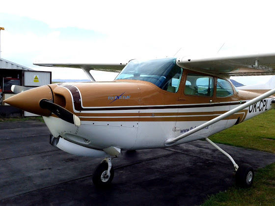

# C172RG

Теперь я знаю кунг-фу... а не, не так, теперь я умею летать на Cessna 172RG! Так как мне предстоит IR и CPL летать именно на 172й, то сегодня я съездил на “родной” аэродром Sazena и получил квалификацию на тип. Вот он этот красавец

В отличие от двухместной Cessna 150, у которой пустой вес всего 500 кг, а максимальная взлетная масса 750 кг, двигатель 100 л.с. и средняя скорость около 140 км/час, четырехместная Cessna 172RG уже пустая весит 760 кг, может взять на борт еще 400 кг (включая топливо и пассажиров), под капотом у нее двигатель 180 л.с., позволяющий лететь со средней скоростью 260 км/час. Ну и еще у нее шасси убирается.

Когда заводишь двигатель... ммм, звук непередаваемый (опять же по сравнению со 150й цессной), примерно как завел порше или феррари. А когда выжимаешь ручку газа до упора - так и чувствуешь все эти 180 лошадок, раскручивающие винт.

Ну и управление будет посложнее, чем у C150  - изменяемый шаг винта, убирающееся шасси, шторки у двигателя, больше приборов.

В общем, нет слов!

А да, у меня уже общий налет 87 часов 27 минут, из них первым пилотом (PIC) 54 часа 57 минут :Р Примерно через две недели начну ночные вылеты.