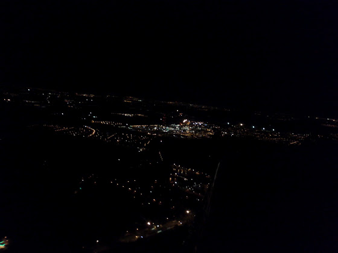
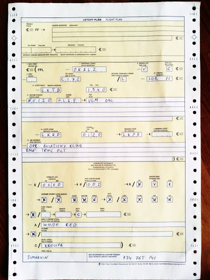
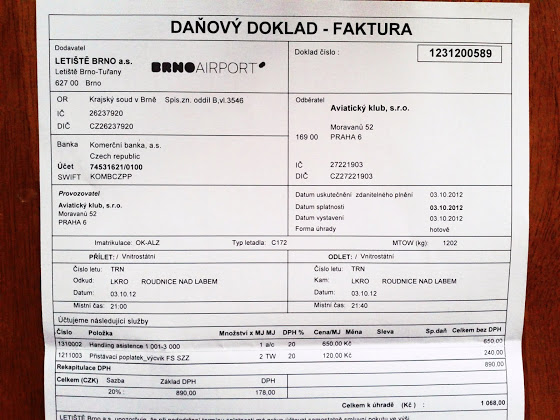

# Night

На днях наконец-то отлетал “ночь”. “Наконец-то” - потому что долго ждал, пока ночи станут длиннее, потом оказалось, что на Сазене взлетка еще не готова, а в Водоходах начинают летать ночью только ближе к концу октября. В итоге я договорился отлетать в Роуднице, недалеко от Сазены. На удивление встретил там своего старого инструктора, который меня еще ультралайтам учил, с ним и летал.

Обучение длится 2 дня, точнее две ночи. В первую ночь в первые полчаса просто летаешь и осваиваешься. Вообще, подсвеченные города, дороги и фабрики выглядят очень круто. К сожалению, я смог сфотографировать только на пропеллер от 152й цессны, поэтому сорри за качество.

<!-- more -->
Дальше налетываешь 1,5 часа с инструктором по кругу, выполняя приземления/взлеты на освещенную полосу, и в конце еще полчаса один уже без инструктора. Я бы сказал - необычно и непривычно. Поначалу думаешь, что до полосы еще лететь и лететь, а на самом деле она чуть ближе, чем кажется.

Вторая ночь. Нужно спланировать маршрут на другой освещенный аэродром, подать план полета и слетать туда/обратно. Я летел в Брно - первый международный аэропорт, в котором я сел сам.

Почти все как на большом самолете (в прицнипе C172RG не такой уж и маленький) - набираешь высоту, выходишь на флайт левел, летишь через заданные точки (мы летели через VORы), приземляешься, паркуешься по указаниям. Дальше за тобой приезжает машина, которая отвозит тебя до здания аэродрома, где можно подать уже второй план полета обратно, выпить чашечку кофе, пройти таможню (если полет международный). В общем, весь этот сервис + плата за приземление стоили мне почти 1100 крон.

Ну и потом обратно из Брно через Пражский аэродром практически над самоей Прагой на FL65 обратно в Роуднице. Вот так, теперь осталось только доехать до UCL (местное управление гражданской авиации) и получить NIGHT в свою лицензию.