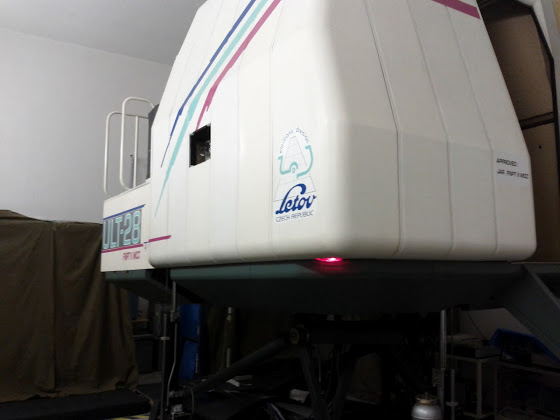
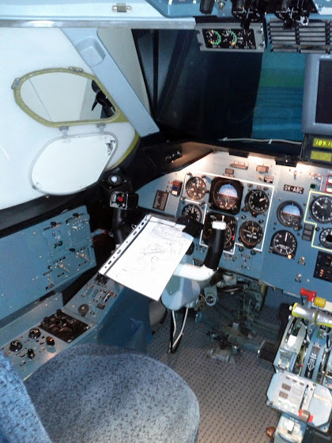
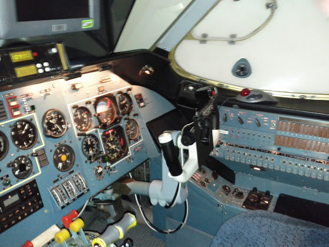
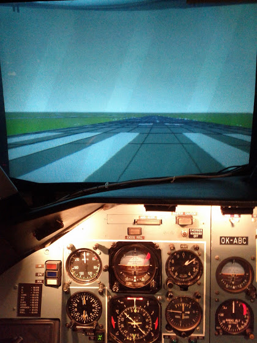

# IR. Начало

Так как у меня уже есть ночной рейтинг и более 50 часов в качестве первого пилота, то я съездил на этой неделе в Fly For Fun на Сазену и записался на курс IR (Instrument Rating). Курс состоит из двух частей. Первая часть - полеты на симуляторе, вторая - на самолете C172RG. Сегодня я отлетал первые часы первой части :Р

Немного о симуляторе. Это так называемый FNPTII с кабиной от АН-28 с подвижной платформой (full motion), стоит эта дура в другой авиашколе Let’s Fly, где я сейчас прохожу теорию по ATPL. Вот так он выглядит снаружи.

<!-- more -->

Но это только одна кабина, еще есть внешнее место оператора\диспетчера, целая комната с какими-то жужжащими девайсами, и, вон там на фото, прикрытые шкафы с доп.оборудованием. Сам симулятор работает на юникс системе (не знаю какая точно) вот уже 40 лет.

Вот это место первого пилота

Второго

А примерно вот так выглядит экран перед взлетом

На самом деле на экран практически не смотришь, только на приборы. Поэтому во время "полета" там почти "молоко" с небольшой линией горизонта (и то не всегда).

По управлению прямо чувствуешь, что у тебя за спиной не обычный хвост от цессны, а, я бы сказал, тонн 20.

В общем, за сегодня я освоился с полетом по радиалу VOR и заходом на посадку по ILS. Впереди еще почти 1,5 недели "полетов"