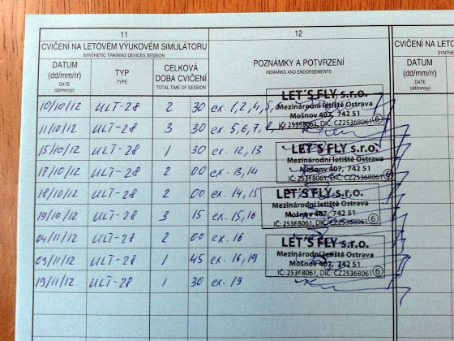
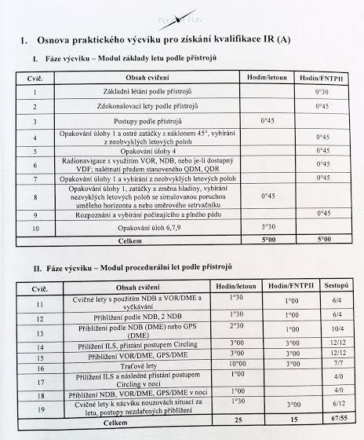

# IR - Simulator

Все, отлетал первую часть IR - 20 часов на симуляторе

Теперь все то же самое, но на самолете и 30 часов

Для тех, кому интересно, что входит в программу, сфотографировал план упражнений

Примерный перевод:

1. Основы полетов по приборам
1. Усовершенствование техники полетов по приборам
1. Техника полетов по приборам (скорее всего то же самое, что и п.2)
1. Повторение п.1 + крутые повороты с наклоном 45
1. Повторение п.4
1. Навигация с использованием VOR, NDB, VDF, полеты по QDM и QDR
1. Повторение п.1 + выход из нестандартных положение (наклоны, направления и т.д.)
1. То же самое, что и в п.7 + имитация неисправности искусственного горизонта
1. Распознавание и выход из сваливания
1. Повторение п.6, 7, 9
1. Полеты по NDB и VOR/DME, холдинги
1. Заходы на посадку по NDB
1. Заходы по NDB/DME или GPS/DME
1. Заходы по ILS + circling
1. Заходы по VOR/DME, GPS/DME
1. Полеты по трассам
1. Заходы по ILS с последующим приземлением округом (circling) ночью
1. Заходы по NDB, VOR/DME, GPS/DME ночью
1. Полеты с отработкой внештатных ситуаций