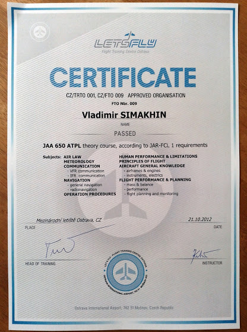

# ATPL экзамены

Примерно пару месяцев назад я закончил теоретический курс по ATPL в Let’s Fly и получил вот такой сертификат

Ну и начал готовиться к экзаменам. Я уже как то писал, что готовлюсь на aviationexam.com, где собраны вообще все вопросы по JAR и FAA ATPL, которые могут встретиться на на тестах (и встречаются один в один). Всего нужно сдать 14 экзаменов, а для этого необходимо правильно ответить на, как минимум, 75% вопросов. На все экзамены отводится 18 месяцев и максимум 6 попыток, причем на один и тот же предмет - только 4. Кстати, знаю одного пилота, который сдал все 14 тестов практически с первого раза, так что если очень захотеть...

Ну так вот, на этой неделе я сдавал первые 6 из 14 экзаменов:

* Navigation - 83%
* Radio Navigation - 94%
* Meteorology - 60% (FAILED)
* Principles of Flight - 77%
* VFR Communication - 93%
* IFR Communication - 95%

Как видно, не сдал только метеорологию.