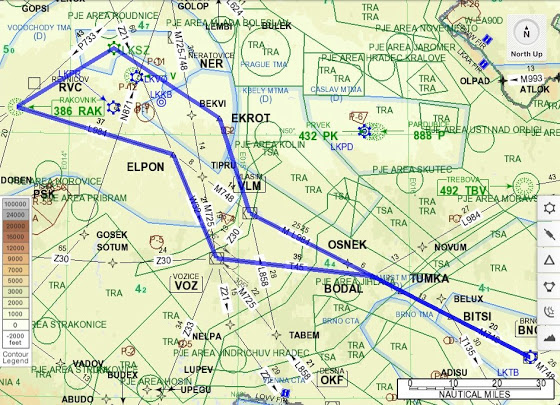

# Экзамены, полеты

На этой неделе сдавал еще 5 экзаменов:

* Aviation Law - 72% (FAILED)
* Airframe/Systems/Power Plant - 82%
* Flight Performance and Planning - Performance - 90%
* Aircraft General Knowledge - Instrumentation - 91%
* Flight Performance and Planning - Mass and Balance - 96%

Не везет мне с "гуманитарными" темами. Там, где нужно считать, чертить, выводить, вспоминать физику\математику - легко учится и сдается. Через месяц буду еще сдавать Human Performance - посмотрим, как пойдет.

Ну и в воскресенье наконец-то слетал в Брно. Диспетчер там оказался немного нервозный - ждал большой самолет, и поэтому тренинг заходов VOR и ILS пришлось делать на большой скорости в 130-140 узлов (240 км\час) и в чистой конфигурации. Инструктор потом сказал, что они там всегда ждут самолеты - завтра, послезавтра и т.д.

<!-- more -->

Немного расскажу о планах полетов, которые пилот обязан подать, если летит IFR. Маршрут (который на картинке) в этом плане записывается как "DCT RAK/IFR N0110 F070 W32 BNO STAY1/0030 BNO M748 VLM/VFR DCT EKROT". Означает, что мы взлетаем и летим прямо на NDB RAK, на этой точке переходим на IFR и на скорости 110 узлов на flight level 70 летим по маршруту W32 до VOR BNO, который находится на аэродроме в Брно, там мы кружимся\тренируемся 30 минут и летим обратно по маршруту M748 до VOR VLM, на котором опять переходим на VFR и летим прямо на точку EKROT, с которой уже возвращаемся обратно домой, незабывая при этом снижатся. Стало понятнее? Нет?

Сам план полета можно подать несколькими способами. Один из них - по телефону. То есть сначала его нужно выполнить на бланке (пример тут) вручную, а потом позвонить на специальный номер и сказать "I’d like to file a flight plan" или "Chci podát letový plán", на что сначала ответят  - "У вас там что, интернета нет?! И факса??". После того, как удастся уговорить сотрудника диспетчерской службы принять его по телефону, начинаешь просто читать план с заполненного бланка, не забывая при этом некоторые сокращения типа VLM говорить как Victor Lima Mike. Через минут 10-15 нужно перезвонить и узнать, если план подтвердили и завели в систему. Все, можно лететь.

Таким способом подачи по телефону я пользовался 3 раза в качестве тренировки. Конечно есть способы проще, легче и удобнее - заполнить в инете на специальном сайте. В Чехии такой сайт - ibs.rlp.cz (нужно зарегистрироваться с чешским номером мобильного), еще есть "универсальные" типа eurofpl.eu.