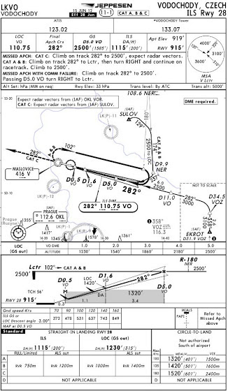

# Водоходы

Сегодня кружил вокруг соседнего аэродрома Водоходы и отрабатывал ILS заходы по схемам.

Кстати, по поводу схем. Как минимум для каждого международного аэродрома существуют определенные процедуры прилетов (STAR - Standard Instrument Arrival), подходов (Approach), вылетов (SID - Standard Instrument Departure), которые используются при полетах по приборам. Поэтому когда я пишу о, например, ILS approach runway 28 - это значит, что я выполняю подход и приземление вот по такой схеме

Сначала кажется, что тут дофига всего и ничего не понятно. На самом деле все очень просто, понятно и нужно.
<!-- more -->

В первой строчке вверху указаны частоты ATIS и вышки. Вторая строчка: LOC - частота локалайзера, Final Apch Crs - финальный курс захода, GS - высота и расстояние пересечения с глиссадой, ILS DA(H) - минимальная высота принятия решения, Apt Elev и RWY - высота аэродрома и полосы над уровнем моря. Чуть пониже - процедуры при уходе на второй круг, правее - MSA (Minimum Safe Altitude) - минимальная безопасная высота вокруг аэродрома. Еще ниже - сама схема/процедура захода.

Например, начало в точке SULOV на высоте 2 500 футов, поворот направо на курс 129, далее при пересечении радиала 174 от VOR NER еще один поворот направо на курс 174, на расстоянии 9.9 морских миль от VOR NER поворот направо курсом 237 до пересечения с локалайзером, выравнивание и стабилизация, и на расстоянии 5 морских миль от ILS - снижение, удерживая курс и глиссаду.

Далее, ниже таблица с расстояниями и высотами на тот случай, если глиссада (Glide Slope) не будет работать (удерживается курс, и текущая высота сверяется по этой таблице). Еще ниже - вертикальная проекция схемы. И еще ниже - таблицы с вертикальными скоростями в зависимости от горизонтальной, высота принятия решения для полностью работающего ILS и без глиссады (GS out), минимальная видимость и минимальные высоты для выполнения Circle-To-Land (разворот, о котором я писал чуть выше).

Вот так вот на одном листке бумаги формата А5 помещается вся информация по одной схеме\процедуре. Самих схем для каждого аэродрома может быть очень много. К примеру, для пражского аэродрома существует 8 STAR, 10 SID, 13 Approach и 18 дополнительных (схемы парковки, движения по аэродрому, минимальные высоты и т.д.).

Ну вот, пока все. В следующий раз опять полечу в Брно - буду отрабатывать полет по маршруту и заходы по VOR.