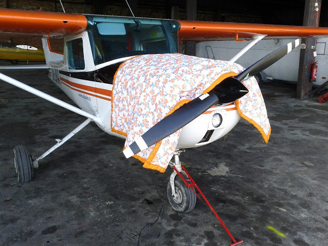
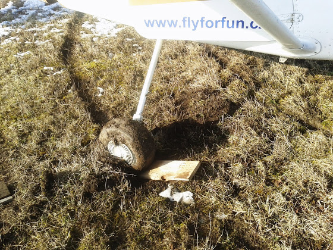

# Удачная зима выдалась этой весной

У нас тут погода немного шалит - то жарко и зеленая трава за окном, то снегом засыпет и в городе транспортный коллапс. Сегодня было -10 С, поэтому самолет пришлось отогревать

Если присмотреться, то можно увидеть провода - это два обычных фена прогревают двигатель перед стартом. На Сазене для этих целей используется специальная тепловая пушка. Вообще, 150я Cessna обычно легко заводится в -10...-15 градусов, а вот 172я - капризная до чертиков, без прогрева еще ни разу не заводилась.

С другой стороны, пару дней назад температура была выше 0, и недавно выпавший снег очень активно таял. В итоге при съезде со "взлетной полосы" на "рулежную" (в кавычках - потому что и то и другое - утрамбованное поле), меня немного повело в сторону и я просто застрял. Пришлось откапываться

