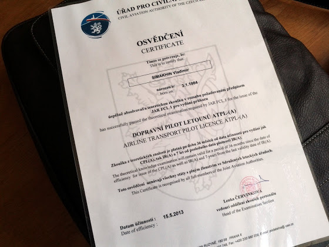

# ATPL теория

Чуть больше полугода чтения умных книжек, 2 недели консультаций, полгода подготовки к экзаменам, 341 час чистого времени на 473 теста, более 14 000 уникальных вопросов, 38 000 протестированных и вот

Я наконец-то сдал все экзамены по ATPL и получил сертификат! Сказать, что я рад - это ничего не сказать. Это такое чувство, что больше не придется сидеть вечерами за учебниками и тестами, ботать тесты в метро и во время обеденного перерыва, что теперь только летать и летать, и что самое сложное уже сдано. В общем, охренеть!

Вот список всех экзаменов с результатами (средний бал - 88%):

1. Aviation Law - 83%
1. Airframe, Systems, Engines & Electrics - 82%
1. Instrumentation - 91%
1. Mass & Balance - 96%
1. Performance - 90%
1. Flight Planning & Monitoring - 80%
1. Human Performance & Limitations - 97%
1. Meteorology - 90%
1. General Navigation - 83%
1. Radio Navigation - 94%
1. Operational Procedures - 86%
1. Principles of Flight - 77%
1. VFR Communication - 93%
1. IFR Communication - 95%