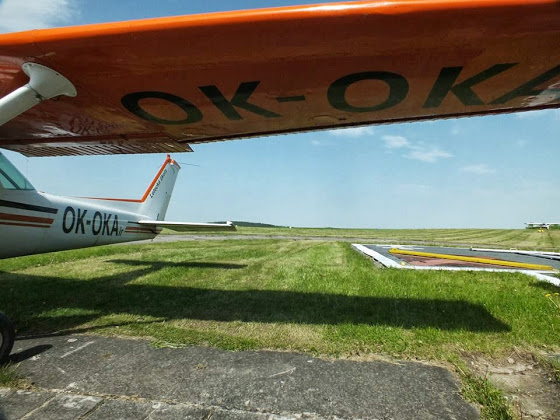

# И такое бывает, часть 2

В воскресенье вечером я собирался слетать из Бубовиц в Зноймо и обратно, всего около 400 км. В районе 8-9 вечера Пражский и Брненский TAF давали грозу, но я планировал вернуться в 7.30, так что все должно быть нормально. Ну ок, маршрут составлен, NOTAMы прочитаны - полетели. Примерно за 100 км до Зноймо встречный ветер начал понемногу усиливаться, а еще через 50 км был уже около 40-50 км/час, то есть моя воздушная скорость была 80 узлов (~140 км/час), а скорость относильно земли 50 узлов (~90 км/час). В принципе, можно было лететь чуть пониже, у земли скорость ветра меньше, но и трясло бы там больше. Так как моего пассажира начало немного укачивать, то я все-таки решил долететь до Зноймо и приземлиться, тем более в обратную сторону ветер бы дул в хвост и скорость относительно земли должна была быть в районе 110-120 узлов (~200 км/час), так что я в любом случае успевал вернуться обратно.
<!-- more -->

Обратно мы вылетели с получасовой задержкой, и тут была моя ошибка, что я не посмотрел погоду. Визуально грозовой фронт был очень далеко, но буквально через 15 минут полета он уже был слева-спереди от меня. Я переключился на Prague Info и запросил информацию:

- Prague Info, OK-OKA, flight from Znojmo to Bubovice without flight plan, altitude 3 000 feets, squawk 7000, what is the current situation with weather on my route?

- Storm goes from the south south-west to the north, will be in front of you in about 20 minutes, I recommend you to return back to Znojmo if you want to be safe, Prague Info.

Хм, влетать в шторм в здравом уме - это тянет на дарвиновскую премию, но и вернуться в Зноймо не получится, т.к. там тоже уже затянуло облаками, да и ветер был уже достаточно сильный. Дальше мы еще немного пообсуждали с диспетчером, куда я все-так смогу долететь, и в качестве вариантов были выбраны Йглава и Брно. С Йглавой связаться не удалось, никто не отвечал, и так как я не был уверен, что там вообще кто-то есть и будет хоть какая-то возможность припарковать самолет и переночевать, то я полетел в Брно, тем более я там уже был и точно знаю, что хотя бы в аэропорту, но можно будет провести ночь.

Ну а дальше меня перевели на Brno Radar, довели по радару до аэродрома и я приземлился. Сначала маршал просто хотел поставить "каблуки" под колеса, но когда я у него спросил "не улетит ли самолет в такой ветер вместе с этими деревянными штуками", он посмотрел многозначительно наверх и принес веревки. Вот так вот самолет переночевал грозу, привязанный на спец.площадке, а мы - в небольшой комнате для пилотов.

Утром я сначала хотел вылететь в 4 утра, благо ночной допуск позволяет, но METAR и TAF давали низкую облачность и температуру 10\09. Поэтому вылетели уже в 6 утра и направились в сторону Бубовиц, тут уже долетели без проишествий. Ну а потом быстренько домой, переодеться и на работу.

Кстати, перед вылетом из Брно я попросил заправить самолет. Нужно было видеть лицо заправщика, приехавший на большом грузовике Shell, когда я сказал, что мне 20 литров в одно крыло и 20 литров - в другое. Кажется, это был самый минимальный заказ в его жизни.