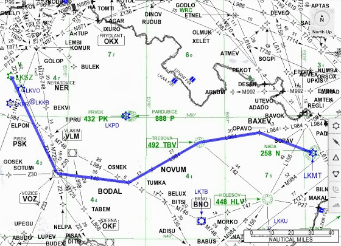
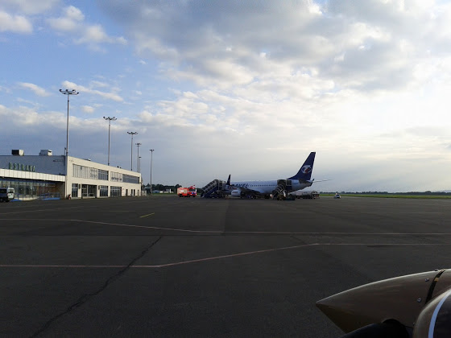
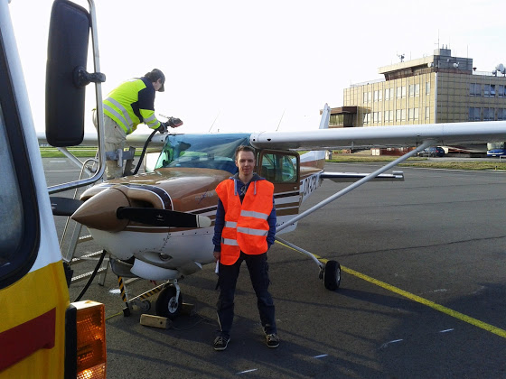
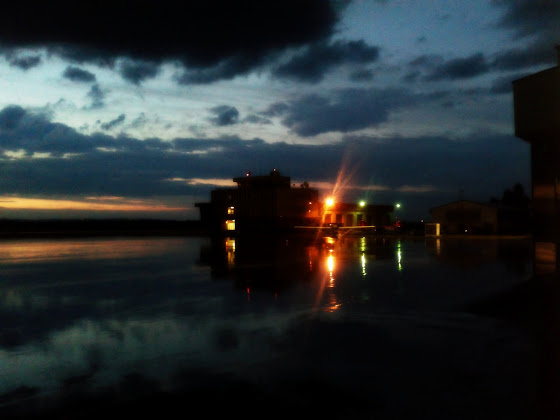
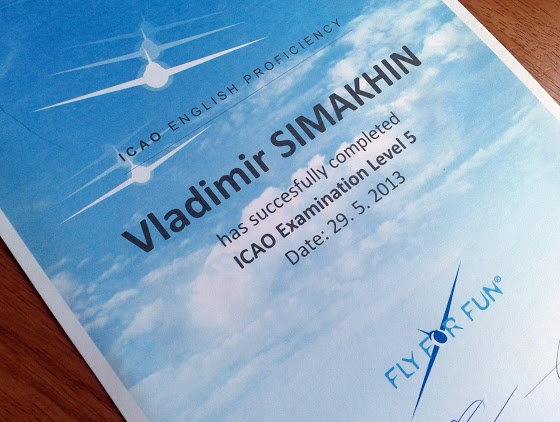

# "Ночные" и английский ИКАО

Для того, чтобы закончить курс IR, мне нужно было долетать пару часов ночью. Сейчас, летом, когда солнце заходит почти в 22:00, "ночные" летать можно только в Остраве, так как на других аэродромах в это время учебные полеты запрещены. Острава находится на границе с Польшой, поэтому до нее еще нужно было долететь. Изначально маршрут планировался по такой схеме:

<!-- more -->
Но диспетчер практически сразу после вылета дал нам shortcut прямо на точку BAXEV, в итоге мы сэкономили чуть больше получаса. Приземлились, запарковались недалеко от боинга

заправились (меня тут немного перекосило)

и пошли ждать захода солнца в брифинг-рум. Перед самым вылетом прошел небольшой дождь и вид на стоянку был примерно вот таким

Ну а потом целых два часа заходов по VOR и ILS на освещенную взлетную полосу. Во время последнего захода инструктор попросил включить огни "low visibility" (заход по ILS CAT II) - сверху это выглядит просто невероятно. А утром мы вылетели обратно, только на этот раз никаких shortcut-ов уже не было, летели по запланированному маршруту. В итоге я долетал всю программу по IR, и теперь жду, пока мне подготовят все документы, чтобы в понедельник можно было поехать в местный CAA (министерство гражданской авиации) и записаться на практический экзамен.

Да, еще в этот же день вечером у меня был экзамен по ICAO английскому. В прошлом году я уже сдавал его на 4й уровень, в этот раз я хотел пересдать на 5й. ИКАО4 - это минимальные требования для пилотов, летающие заграницей, что-то типа Intermediate уровня, 5й - уже Upper-Intermediate, 6й - родной язык или соответствующий уровень владения им.

На экзамене нужно сначала рассказать о себе и ответить на какие-то общие вопросы, в основном на авиа-тему. Потом дается запись ATIS, нужно прослушать, записать и повторить. Следующий тест - имитация разговора диспетчера с пилотом. И напоследок - нужно прочитать статью в журнале и объяснить ее смысл, опять же на английском. В итоге у меня теперь ИКАО5

Нужно будет только доехать до CAA и проставить соответствующую запись в лицензию.