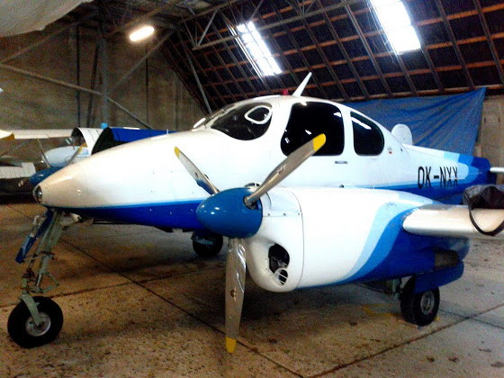
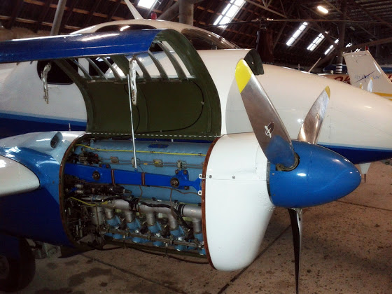

# Многомоторные

Следующий шаг к карьере пилота - многодвигательные самолеты. Так как погода у нас совсем не летная, то сегодня была просто теория. И так, знакомьтесь, это Morava L200D

У этой птички два шестицилиндровых двигателя, мощностью 210 л.с. каждый (жрут они, кстати, по 45 литров авиационного бензина в час). Я прям жду того момента, когда смогу дать полный газ на этой пепяке.

Внутри еще больше приборов, тумблеров и рычагов (по сравнению с C172RG), но так как свет в ангаре не позволил сделать более менее качественные фотографии, то расскажу об этом в следующий раз.

2,5 часа теории по устройству самолета, процедур и т.д., и потом еще 40 минут я самостоятельно сидел в кабине и имитировал запуск двигателя, рулежку, взлет, круиз и приземление. На первый взгляд, все немного сложнее, чем в той же С172, но, в то же время, круче в несколько раз :Р