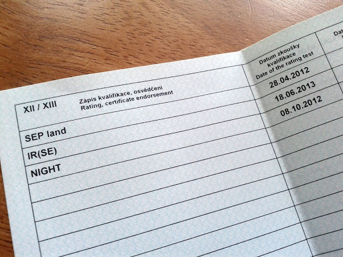

# IR(SE)

Вчера сдал практический экзамен, сегодня проставил рейтинг в лицензию

В качестве экзамена был полет из Водоход (LKVO) в Карловые Вары (LKKV) с двумя ILS заходами, один из них GS OUT (без глиссады). Следующий шаг - IR(ME), нужно только заполнить все документы, и можно будет опять идти записываться на экзамен.