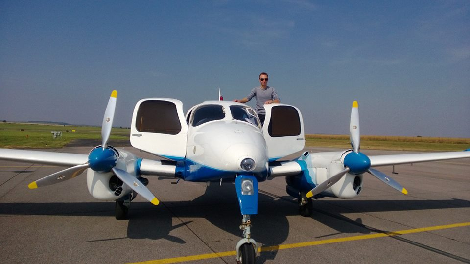

# MEP+IR(ME) чек-райд

Чек-райд у меня был назначен на 8.30, поэтому день начался в 6 часов утра. В 6.30 после чашки кофе я уже ехал на Сазену, где меня ждал инструктор и сам самолет, который нужно было сначала перегнать в Водоходы. Водоходы - международный аэропорт со всей инфраструктурой (диспетчеры, системы инструментальных заходов и т.д.), поэтому чек-райд проводился именно там (свой первый Instrument Rating я тоже там сдавал).  Пока прогревались и проходили чек листы, над нами пролетел экзаменатор - хотел бы я тоже на работу на самолете летать.

Небольшой брифинг перед самим чек-райдом, и полетели

* выход на SULOV и заход по ILS 28
* missed approach и заход по NDB10
* missed approach с выходом на racetrack и на ILS28 на одном двигателе с приземлением
* еще один NDB10 на одном двигателе c go-around
* пару выходов из сваливания, правда на всех двух моторах
* полет на одном двигателе по прямой + повороты
* повороты с наклоном в 45 градусов (ждал своей очереди на приземление в третьем повороте, кругов 5 сделал в каждую сторону)
* визуальный заход на одном двигателе с полным приземлением

Конечно нервничал немного, забывал периодически выставить обороты пропеллеров на максимум при заходе на посадку, компрессоры выключать при отключенном двигателе и еще пару мелких косяков. Зато ни разу не потерял высоту и курс при выключении мотора - прям даже горжусь собой немного.

На следующей неделе поеду проставлю себе две новые строчки в лицензию.

