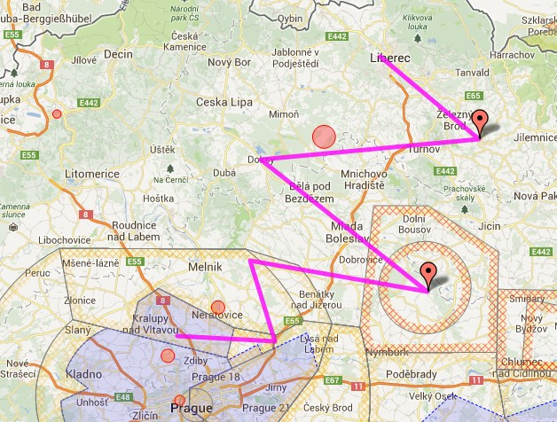
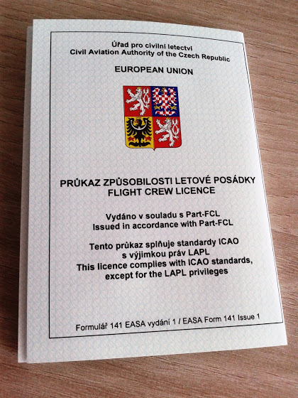
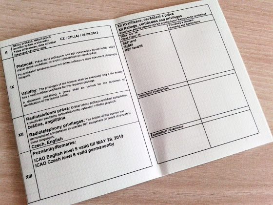

# CPL чек-райд

Ну вот и все, пройден последний чек-райд на CPL. Вот таким был маршрут

Нужно было пролететь используя карту и стандартное навигационное оборудование без каких-либо GPS. Так как в этот день шли местами дожди, то меня еще проверили на знание METAR, TAF и погодных карт. VOR пригодился только на двух участках, когда летел к и от VOR NER. Все остальное время только ориентация по карте. В принципе, если лететь между аэродромами, то северную часть Чехии я знаю практически наизусть, и могу даже где-то пролететь без карты, но вот лететь участки между населенными пунктами - тут уже посложнее. Плюс когда я летел возле вооон того красного кружка на карте (запрещенная для полетов зона), экзаменатор сказал, что перед нами вдруг внезапно образовались грозовые тучи и нужно уйти на заброшенный аэродром, и тыкнул в карту. Вот так вот, ориентируясь по всяким горам, озерам и дорогам я вылетел на этот старый аэродром, над которым экзаменатор еще и сымитировал остановку двигателя (поставил на idle). И так 4 раза.

В итоге теперь у меня есть лицензия коммерческого пилота

и полный "джентельменский" набор в виде SEP, IR(SE), MEP/IR, ICAO English 5 и ATPL теории.

Общий налет за все время обучения получился 205 часов, не считая 23 часов на симуляторе:

* на однодвигательном (C150/C152, C172/C172RG)  - 195 часов
* на многодвигательном (L200 Morava) - 10 часов
* по приборам - 41 час
* ночью - 8 часов
* в качестве Pilot in Command - 104 часа
* кол-во приземлений - 367

Чуть меньше, чем 3 года назад я первый раз взялся за штурвал на ультралайте, и 1,5 года назад начал учиться на профессионального пилота.