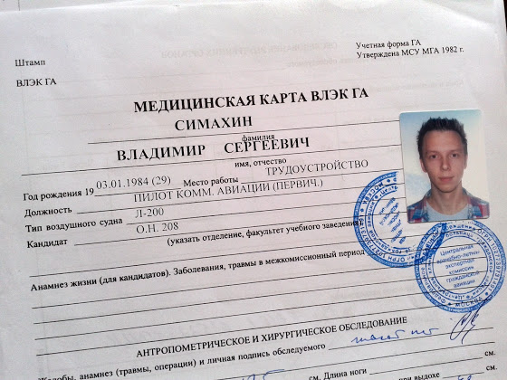
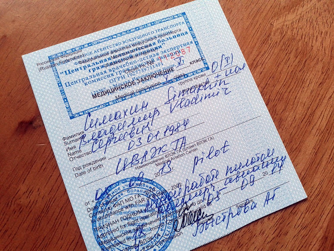
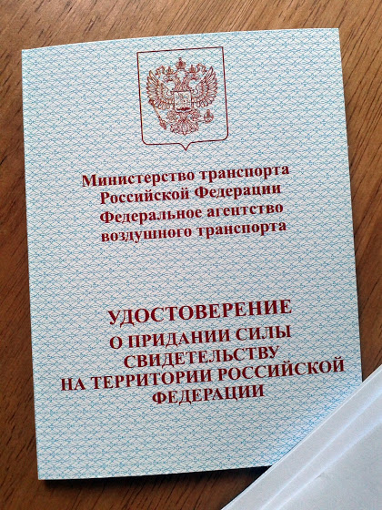

# ВЛЭК и валидация

Всю прошлую неделю я был в Москве, проходил нашу медкомиссию и валидировал лицензию, поэтому напишу пару слов о "бессмысленном и беспощадном", ну и о самом процессе валидации, чтобы больше никто не наступал на мои грабли.

Изначально я хотел пройти ВЛЭК в Домодедово, прочитал форумы на эту тему, подготовил все справки и поехал. Оказалось, что они в отпуске (а я то думал, что они трубку как всегда просто так не берут), поэтому из реестра ВЛЭКов был выбран первый попавшийся в Москве - ЦКБ ГА - центральная медкомиссия, куда направляются пилоты, не прошедшие обычный ВЛЭК.

<!-- more -->
Итак, чтобы пройти первичный осмотр в (Ц)ВЛЭК нужно при себе иметь пару справок:

* справка от нарколога и психиатра по месту жительства - делается за 10 минут в психонаркодиспансере
* выписка от терапевта о болезнях за последние 3 года. Так как я последние 3 года провел в Чехии, то просто съездил в поликлинику, где я лечился последний раз, и взял справку, что последний раз я у них был почти 4 года назад с обычной простудой.
* желательно при себе еще иметь результаты анализов на ВИЧ, сифилис, гепатит А и Б, группу крови и резус-фактор. В принципе, это все можно сделать и при прохождении комиссии, но это может занять несколько дней (а мне все нужно было сделать очень быстро). Эти анализы я сделал в Инвитро, результаты были готовы на следующий день.

Далее в секретариате оформляют дело и выдают мед.карту

и дают список врачей, которых нужно пройти и оплатить. Все обследование со всеми анализами в итоге мне вышло примерно в 16 000 руб.

Вообще, я читал много всяких страшилов про нашу медкомиссию, но ни разу не столкнулся ни с одной из них, что уж там говорить, даже жопоскопии, о которой так пишут все пилоты, не было. Практически все врачи были адекватные. Затык случился только со стоматологом и неврологом. Стоматолог внезапно нашла 3 дырки, и на мои попытки объяснить, что в Праге невозможно записаться за неделю к чужому врачу без острой необходимости, когда твой в отпуске, да еще в августе, когда у чехов каникулы, я был практически послан со словами "нехрен тут лапшу на уши вешать, в Европе можно все". Я уж было подумал, что на этом этапе мое обследование заканчивается, но главный лор-врач просто написал рекомендацию о необходимости подлечить зубы до следующего года.

Второй совсем небольшой затык был у невролога, она потребовала прохождение психолога и психотестов, которые изначально мне не назначили. В принципе ничего страшного, но запись на тесты была только на следующий день, а это был уже четверг, и у меня оставалась только пятница, чтобы пройти валидацию. Кстати, наши психотесты по сравнению с чешскими - так себе, проходятся за полчаса и очень легкие.

Ну вот, на все прохождение ВЛЭК у меня ушло 3,5 дня (с середины понедельника по четверг). В конце, после заседания врачей выдают медицинское заключение

Следующий шаг - валидация лицензии CPL в Росавиации. Сначала нужно позвонить и записаться на прием. Записываться можно тольза за день, ни о каких за пару недель речи не идет, и стоит это делать прямо с 9 утра, потому что после 10.30-11.00 уже не записывают - нет мест.

Для валидации нужно будет подготовить:

* заявление - пишется от руки просто в произвольной форме
* летная книжка аля логбук
* паспорт + копия
* лицензия + медикал + заверенный перевод. Я пришел без перевода (как-то пропустил этот момент) и был отправлен его делать, даже с учетом того, что все пункты в лицензии продублированы на английском. Дальше был обзвон бюро переводов на предмет срочного перевода, и только одна из 10 компаний (ЭксЛибрис) согласилась его сделать в течение 1,5-2 часов. Медикала в официальном списке документов нет, но я на всякий случай подготовил перевод, т.к. в теории лицензия без него не действительна.
* влэк + копия

При наличии всех этих документов\копий валидация делается за 15 минут

Удостоверение действительно в течение года (до конца срока действия ВЛЭК), самолет сухопутный многодвигательный, второй пилот. Так как я все равно устраиваться буду вторым пилотом, то на строчке КВС я особо и не настаивал.