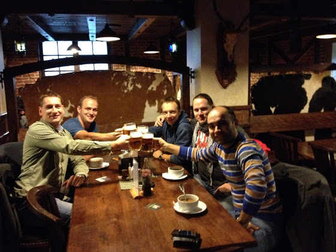

# Последние новости

Давно не писал, хотя за последние пару месяцев произошло много всего.

Во-первых, я уже больше двух лет как папа. Мартину в октябре исполнилось 2 года, Адриана тоже не отстает, ей уже почти 6 месяцев. Удивительный ребенок, полная противоположность брату. Если Мартин не мог и трех секунд посидеть тихо на одном месте и требовал экшн, то Ди-Ди может лежать на кровати, тупить куда-нибудь, улыбаться и угукать.

Дальше. Я закрыл контракт и уволился со своей работы в Праге. В Concur’e я проработал почти 2,5 года, занимаясь системами мониторинга всего, что у нас было, которые в автоматическом режиме проверяли состояние фронт\мидл\бэкэнд и отсылали алерты куда и кому нужно. Т.е. моей работой было “знать о факапе задолго до его появления”. Если учесть, что у нас около 2000 серверов по всему миру в нескольких датацентрах, и в день наш мониторинг обрабатывал по 500 гигабайт данных, то было это все довольно интересно. В общем, все было хорошо, но меня пару лет назад укусил самолет, поэтому теперь мне хочется в небо.

Мой последний день на работе в качестве айтишника... а начинал я все это в 2001 году админом-эникейщиком

Поиск работы пилотом. Начал я с рассылки резюме по всем авиакомпаниям Европы, Азии, Африки и России, куда я хоть как-то подходил левой пяткой. Вообще, когда у тебя налет 200 часов и нет никакого тайп рейтинга, становится очень уныло, т.к. с таким “опытом” ты просто становишься неуловимым Джо, который нафиг никому не нужен.

После рассылки около 130 резюме, я начал обзвон наших российских компаний. Топ самых адекватным в моем чарте занимают ЮТэйр, Татарстан, Аэрофлот и Газпромавиа. В последние две компании меня бы не взяли без летного образования, но дали пару советов. Татарстан - если бы не катастрофа, то с большой вероятностью сейчас бы уже скорее всего летал на Караванах.

ЮТэйр - одна из компаний, где я был на оффлайн собеседовании. У них как раз был набор выпускников этого года, а так как я получил лицензию в этом году, то я формально подходил. Единственным дополнительным требованием было пройти наш ВЛЭК и сделать валидацию лицензии. На собеседовании было около 60 человек, и сам процесс напоминал экзамен в университете - садишься за стол, тебе задают вопросы по аэродинамике, метеорологии, английскому, джеппесону, QRH и т.д, получаешь оценки и все, через месяц ждешь результаты. По всем “предметам” я получил пять, кроме тройки по аэродинамике, т.к. не ответил на вопросы по кривым Жуковского. Специально ни к чему не готовился, хватило знаний еще с ATPL теории. Кстати, по поводу знаний. Пока я сидел ждал своей очереди, и слушал ответы выпускников наших российских училищ, у меня сложилось неоднозначное впечатление. Не ответить на элементарные вопросы по метеорологии, спороть фигню на английском и увидеть только фигу на картах - ну хз, возможно мне просто попалась такая “выборка”, а все остальные были гуру в своей области. В любом случае, я нисколько не жалею, что учился в Чехии.

Ну неважно. Собеседование я прошел, дальше начался процесс проверки лицензии и документов, потом проверка отделом безопасности, потом дату начала обучения перенесли на неопределенный срок, потом... все, пока больше ничего.

Еще на одном собеседовании я был в европейской компании бизнес-авиации. Там все хорошо, но как я уже писал выше, 200 часов - это ни о чем.

Что сейчас... сейчас я сижу в гостинице в Смоленске, а завтра я уже буду в Вильнюсе, где в понедельник в Балтик академии у меня начнется трейнинг на B737CL, и продлится он следующие 1,5 месяца. Ну, посмотрим, что из этого выйдет. Писать часто не обещаю, времени будет не очень много.

Ну вот как-то так.