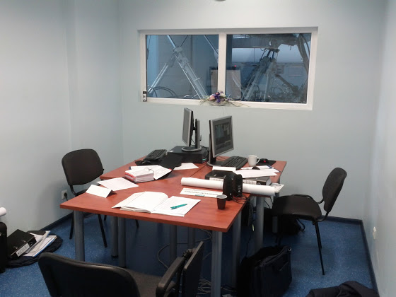
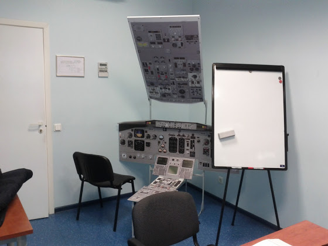
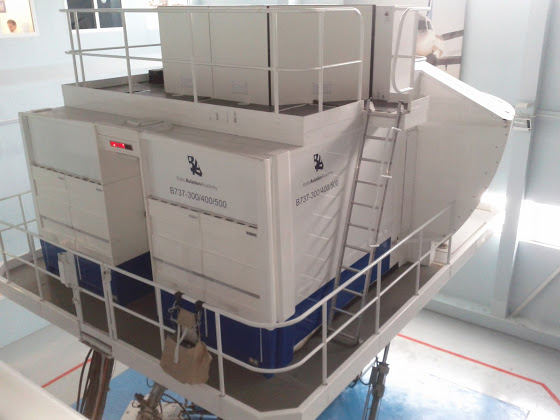
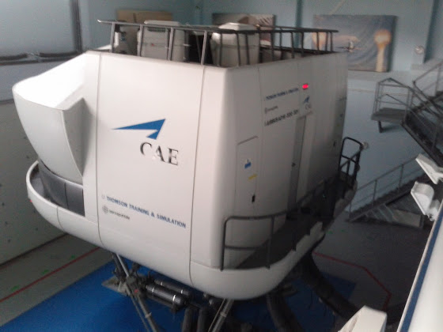

# Первые дни трейнинга

Итак, у меня начался CBT (Computer Based Training) по Boeing 737 Classic. Целый день я сижу за компьютером и слушаю умные лекции в перемешку с прочитыванием еще более умных книжек. Каждые 2-3 дня по расписанию промежуточные тесты, т.е. первый будет уже завтра.

Наша группа состоит из 2 человек: я и испанский коллега пилот. Причем пилот в прямом смысле этого слова - его налет составляет около 5 000 на ATR42/72, и он уже успел полетать в левом кресле капитаном. Не знаю, почему на 737 такие маленькие группы, в соседней аудитории на A320 сидит около 8-10 человек. Ну а наша выглядит вот так:

 

<!-- more -->

На первой фотографии в окне можно увидеть фул моушн симулятор B737-300/400/500, на котором мы потом и будем “летать”. Сверху он выглядит вот так

Справа от него стоит симулятор A320

Что еще… нам выдали кучу доков по 737: FCOM из двух частей, FCTM, SOP, QRH, пару мануалов для Mass&Balance, чек листы, принт всей приборной панели (уже повесил себе на стенку) и т.д.  В общем, все очень круто и интересно!