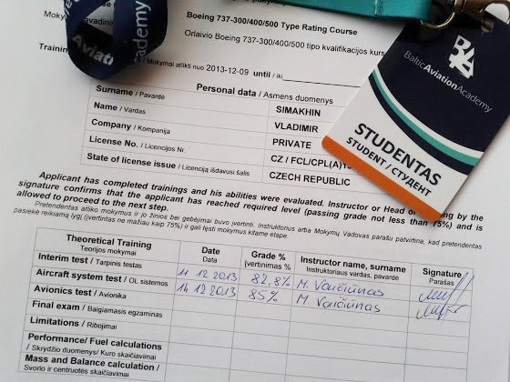

# Первые промежуточные тесты

Ну вот, позади неделя учебы и 2 теста

Первый тест включал в себя 35 вопросов по Aircraft General, Emergency, Engines, APU, Electrical systems, Fire detection&protection, Hydraulic systems, Flight controls, Lightning.

Во втором тесте на 60 вопросов были дополнительно еще Warning systems, Landing gear, Brakes, Fuel, Ice protection, Air systems.

Что интересно, вопросы у меня и испанца не совпадали совсем, т.е. вероятность списать просто никакая, да и некогда.

Впереди еще 5 письменных тестов, а потом начнется MCC (такой специальный курс, где ты учишься работать/летать в команде), который у меня интегрирован с получением тайп-рейтинга.