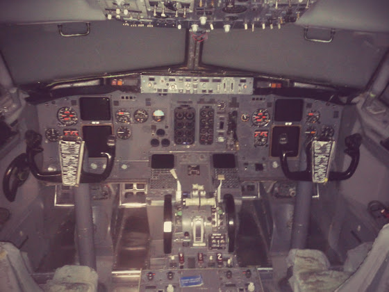

# Приятный сюрприз

Один из плюсов учебы в предновогодние дни - в учебном центре пусто, и, как следствие, можно потренировать процедуры и колл-ауты прямо на симуляторе (обычно он занят чуть ли не 24х7).

Даже с учетом того, что симулятор был в статике, ощущения все равно были невероятные - прям чувствуешь 60 тонн у себя за спиной! Ну и с цессной, и даже моравой, конечно же, не сравнить - все совсем по другому.

В общем, можно считать, что вчера я первый раз приземлил боинг, хреново, но приземлил.