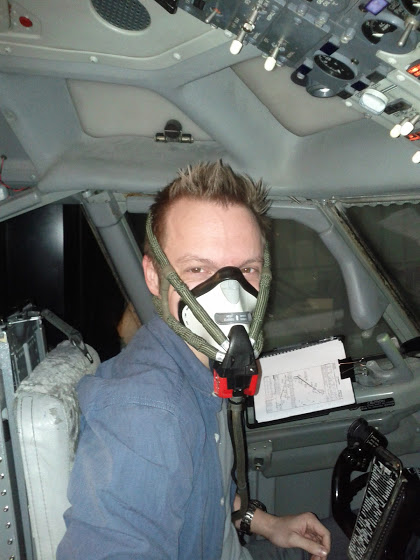

# Конец первой части, продолжение следует

Все, первая часть курса закончена. В следующем году, уже второго января, у нас начинаются полноценные сессии на симуляторе.

Что я могу сказать. Учиться летать на боинге сложно. Даже с учетом того, что мы сдали итоговые теоретические тесты на отлично, все равно приходится перечитывать какие-то разделы, повторять и повторять процедуры. И все это просто жуть как интересно!

Как я уже писал, часть CPT (Cockpit Procedure Training) у нас был не за стендом, а прямо на симуляторе. Когда мы отрабатывали процедуры сидя перед воображаемой панелью - все было гладко, мы ничего не забывали и вообще казалось, что чего там летать-то на этом боинге. Ага… Первые впечатления от полета в кабине были "@#$%^&!! я еще не успел закрылки убрать, а он уже 5000 набрал!!"

